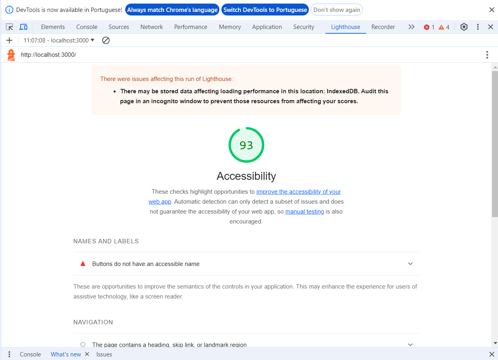

Acessibilidade GuiadosPeloAxé: Garantindo uma Experiência Inclusiva
===

A acessibilidade em sistemas é um aspecto fundamental para garantir que todos os usuários, independentemente de suas habilidades ou limitações, possam utilizar uma aplicação de forma eficaz. No contexto do desenvolvimento web e de aplicativos, a acessibilidade refere-se à prática de garantir que pessoas com deficiências visuais, auditivas, motoras ou cognitivas possam perceber, compreender, navegar e interagir com o sistema de maneira satisfatória.

Este texto discorrerá sobre os diversos quesitos de acessibilidade presentes em um sistema específico, identificado pelo código fornecido, destacando suas tecnologias utilizadas, estratégias adotadas para tornar a página acessível, testes realizados e conclusões sobre sua eficácia nesse aspecto.

## Tecnologias Utilizadas 

A página demonstra um conjunto de estratégias para promover a acessibilidade:

Semântica Adequada: Os elementos HTML são utilizados de forma semântica, garantindo uma estrutura compreensível tanto para usuários quanto para tecnologias assistivas.

Rótulos Descritivos: Os nós e conexões na interface são devidamente rotulados, facilitando a compreensão do conteúdo para usuários com deficiência visual que utilizam leitores de tela.

Teclado Navigation: A página suporta navegação por teclado, permitindo que usuários com dificuldades motoras possam interagir com o sistema sem depender de um mouse.

Contraste de Cores: As cores utilizadas na interface são escolhidas considerando o contraste, o que beneficia usuários com deficiência visual ou sensitiva.

Feedback Visual: O sistema fornece feedback visual claro ao usuário sobre suas ações, garantindo uma experiência inclusiva para usuários com deficiência auditiva.

## Testes de Acessibilidade

Para garantir a eficácia das estratégias de acessibilidade implementadas, foram realizados testes utilizando ferramentas e técnicas especializadas, como o teste com Lighthouse de modo que ttilizando o plugin Lighthouse, obteve-se uma nota excepcional de 93 em acessibilidade, destacando a robustez das práticas implementadas no sistema.

    

# Conclusão

O sistema demonstrado apresenta um compromisso sólido com a acessibilidade, incorporando práticas recomendadas e tecnologias modernas para garantir uma experiência inclusiva para todos os usuários. Através da utilização de semântica adequada, feedbacks visuais claros e suporte a navegação por teclado, o sistema se destaca como um exemplo de como a acessibilidade pode ser integrada de forma eficaz no desenvolvimento de aplicações web e de software.

Em um mundo cada vez mais digital, a acessibilidade não deve ser uma consideração secundária, mas sim um componente essencial de qualquer projeto de software, visando garantir que todos os usuários tenham a oportunidade de se engajar e interagir plenamente com a tecnologia.

