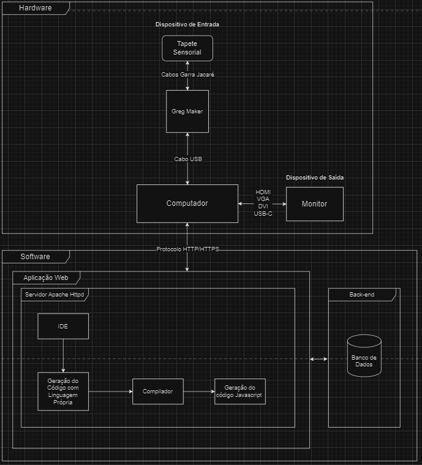
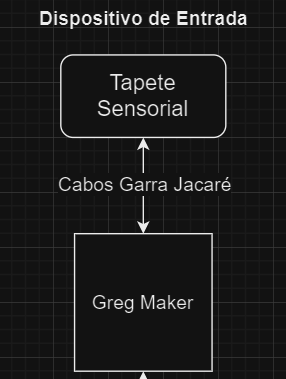
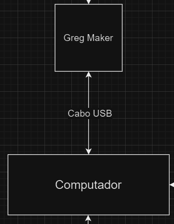
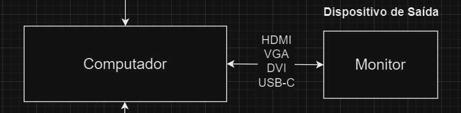
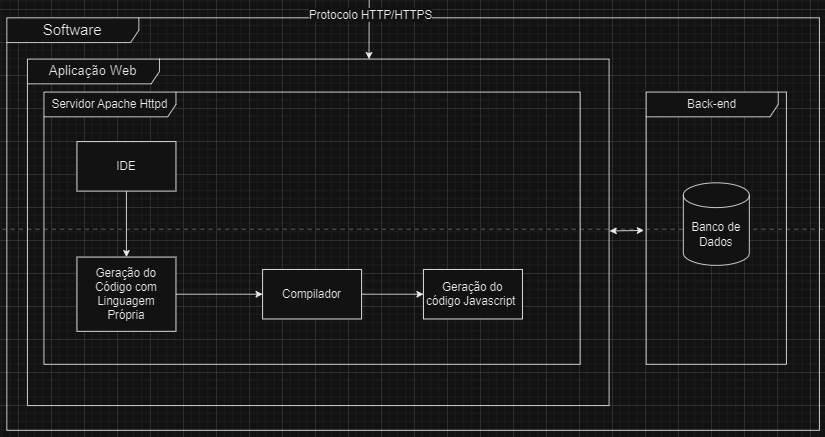

# Arquitetura do Sistema

## Diagrama de blocos

O diagrama de blocos é uma representação gráfica simplificada de um sistema técnico ou processo, que utiliza blocos para representar os componentes ou funções individuais e setas para demonstrar as relações e o fluxo de informações entre eles. É uma ferramenta fundamental na análise de sistemas para ilustrar os principais elementos e suas interconexões de forma clara e acessível, permitindo uma compreensão rápida da estrutura e operação do sistema como um todo.

No nosso diagrama de bloco, dividiu-se em duas partes: Hardware e Software.

Arquitetura do Sistema

Na parte do hardware, estão incluídos os dispositivos computacionais, os dispositivos de entrada e saída, assim como as interfaces de comunicação entre eles, cada um com suas funções específicas no sistema.

O primeiro componente é o tapete sensorial, um tapete de tecido dividido em quadrantes, onde cada um possui uma textura distinta. Para possibilitar a interação com o Greg Maker, fios de cobre foram costurados em alguns quadrantes, permitindo a transmissão de sinais elétricos ao toque.

O Greg Maker está conectado ao tapete sensorial por meio de cabos tipo garra de jacaré, onde cada cabo corresponde a um quadrante. Seu funcionamento é semelhante ao de um Arduino, com a diferença de que ele permite a interação com certas teclas presentes em computadores e notebooks, incluindo as setas direcionais ←, ↑, ↓, → e os botões esquerdo e direito do mouse.

Um cabo USB liga o Greg Maker ao computador ou notebook, que é responsável por acessar a aplicação web e transmitir as informações para o monitor(Dispositivo de saída), permitindo assim visualizar as respostas do sistema.

### Hardware:

### Funcionalidades:

**Tapete Sensorial** (Dispositivo de Entrada):
- ***Função Principal***: Captura a interação física, com cada quadrante contendo fios de cobre que detectam o toque, transformando essa interação em sinais analógicos, que serão enviado ao Greg Maker.

**Greg Maker** (Interface de Entrada para Computação)
- ***Função Principal***: Recebe os sinais do tapete sensorial via cabos garra de jacaré e os converte em comandos digitais, que são enviados ao computador através de uma conexão USB.

**Computador/Notebook** (Dispositivo Computacional)
- ***Função Principal***: Processa os comandos recebidos do Greg Maker e executa a aplicação web(IDE) que é usada para programar e exibir as dinâmicas criadas pelos terapeutas.

**Monitor** (Dispositivo de Saída)
- ***Função Principal***: O monitor exibe as dinâmicas interativas programadas na IDE da aplicação web, bem como os resultados das interações realizadas no tapete sensorial, proporcionando um feedback visual.

### Interfaces de Comunicação:

**Entre o Tapete Sensorial e o Greg Maker**: A interface aqui é uma conexão direta por meio de cabos tipo garra de jacaré. Isso permite que os sinais elétricos gerados pelas interações com o tapete sejam transmitidos ao Greg Maker, que atua como uma interface de entrada para o computador.

    

Conexão Tapete-Greg Maker

**Do Greg Maker para o Computador**: A conexão é feita via cabo USB, que é uma interface padrão para periféricos se comunicarem com computadores. O Greg Maker converte as interações físicas captadas pelo tapete em sinais digitais compatíveis com os comandos de um teclado ou mouse, que o computador pode entender e processar.

    

Conexão Greg Maker-Computador

**Do Computador para o Monitor**: As interfaces de vídeo (HDMI, VGA, DVI, USB-C) são as conexões de saída do computador para o monitor. Elas carregam sinais de vídeo que o monitor decodifica e transforma em imagens visíveis para o usuário, exibindo as dinâmicas interativas e outros resultados de software.

    

Conexão Computador-Monitor

### Software:

Na seção de software do sistema, a conexão entre o computador e a aplicação web é realizada por meio do protocolo HTTP/HTTPS. Quando o terapeuta deseja interagir com a aplicação web, ele usa um navegador para fazer uma solicitação HTTP(S) ao servidor Apache Httpd, que então responde servindo a IDE da aplicação web. Este é o componente central de software que permite aos terapeutas criar dinâmicas interativas personalizadas para as crianças com Transtorno de Espectro Autista.

A principal funcionalidade da aplicação web é a IDE customizada que abstrai a complexidade do código, permitindo que os terapeutas construam dinâmicas utilizando uma linguagem própria.

Uma vez que as dinâmicas são definidas na linguagem própria, o código é enviado para um compilador personalizado integrado na aplicação web. Este compilador traduz o código da linguagem específica para JavaScript.

Depois que o código é compilado, ele é armazenado no sistema, por meio de um banco de dados MongoDB. Quando necessário, o código compilado é recuperado e executado, resultando em dinâmicas interativas que são exibidas no monitor conectado ao computador. Esse ciclo permite que os terapeutas criem, armazenem, e reutilizem as dinâmicas interativas para oferecer uma experiência terapêutica rica e personalizada para cada criança.

    

Arquitetura de Software

### Funcionalidades:

**Interface de Desenvolvimento Integrada (IDE) Customizada**:
- Permite aos terapeutas programar dinâmicas interativas sem a necessidade de conhecimento avançado em programação.

- Oferece uma representação visual das dinâmicas, tornando o processo de programação mais amigável.

**Compilador Personalizado**:
- Traduz o código da linguagem criada para JavaScript.

- Integra-se com a IDE para compilar o código.

**Back-end e Banco de dados**:
- Salva o código da dinâmica compilada no banco de dados.

- Permite o armazenamento seguro e a reutilização de dinâmicas criadas anteriormente.

**Execução e Visualização de Dinâmicas**:
- Executa o código compilado para criar uma experiência interativa na sessão de terapia.

- Exibe os resultados das interações no monitor, proporcionando feedback visual imediato.

- Apoia a terapia com recursos interativos personalizados de acordo com as necessidades da criança.

### Componentes de Software:

**IDE Web (Interface de Desenvolvimento Abstrata)**

- **Função Principal**: Facilitar a criação de aplicações interativas sem necessidade de conhecimento avançado em programação, além de executar as dinâmicas criadas e coletar feedback dos usuários.
- **Componentes**:
  - **Editor Visual**: Permite a montagem visual dos componentes via interface "arrastar e soltar".
  - **Compilador Axé para JavaScript**: Converte os blocos visuais em código JavaScript executável.
  - **Biblioteca de Componentes**: Conjunto de funções prontas para uso nas dinâmicas terapêuticas.
  - **Executável de Jogos/Dinâmicas**: Onde o código JavaScript é executado.
  - **Interface de Usuário**: Design responsivo e adaptável às diferentes funcionalidades.

**Linguagem de Programação Axé**

- **Função Principal**: Responsável pela lógica por trás de todas as funções utilizadas pelos componentes usados pelos terapeutas.
- **Componentes**:
  - **Compilador/Interpretador**: Traduz a linguagem Axé em código JavaScript.

**Sistema de Login e Gerenciamento de Usuários**

- **Função Principal**: Gerenciar o acesso à plataforma.
- **Componentes**:
  - **Autenticação de Usuários**: Sistema de login para acesso seguro.
  - **Gerenciamento de Usuários**: Funcionalidades administrativas para gestão de pacientes.

**Backend e Banco de Dados**

- **Função Principal**: Armazenar dados essenciais da aplicação.
- **Componentes**:
  - **Servidor Web**: Gerencia as requisições HTTP.
  - **Banco de Dados**: Armazena dados de usuários, dinâmicas criadas e feedback.

**Hospedagem na AWS**

- **Função Principal**: Prover infraestrutura de computação em nuvem.
- **Componentes**:
  - **EC2**: Servidores virtuais para execução do backend.
  - **MongoDB/S3**: Armazenamento de banco de dados e arquivos estáticos.