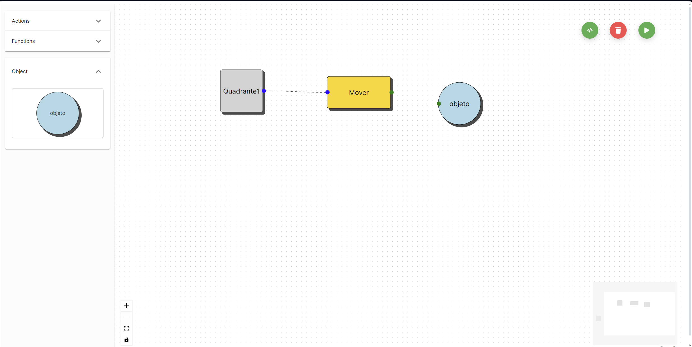
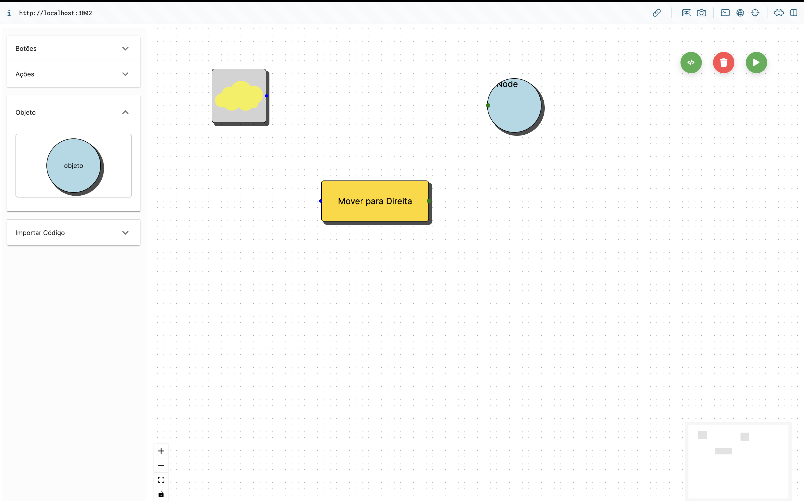
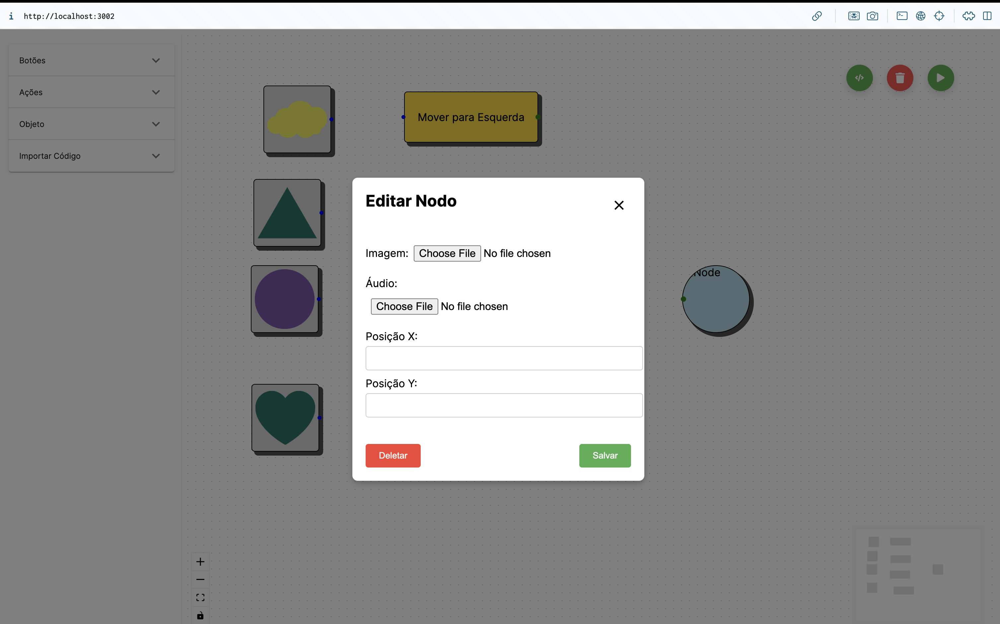
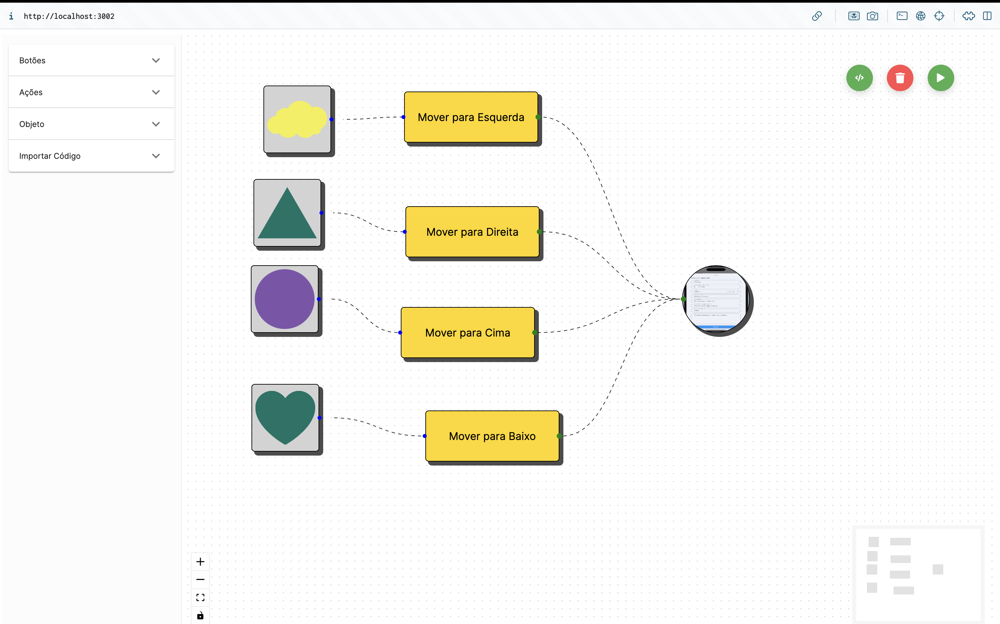
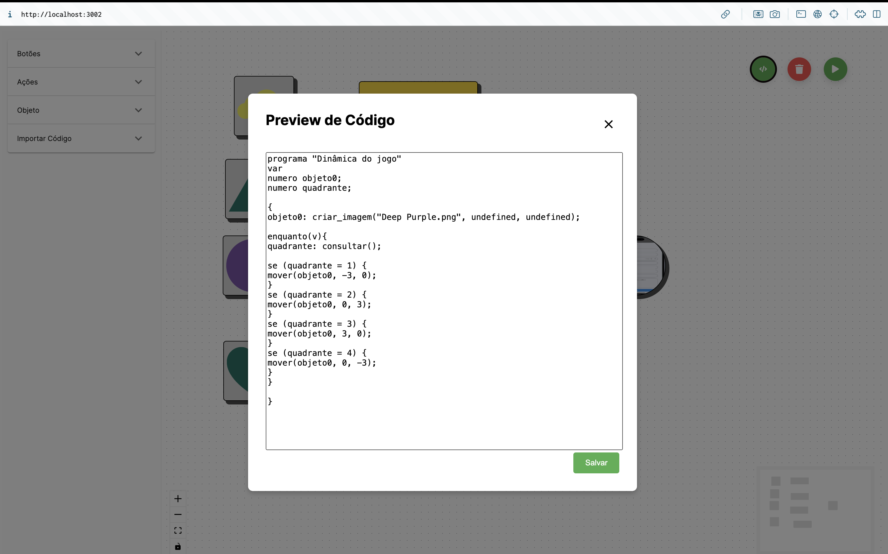
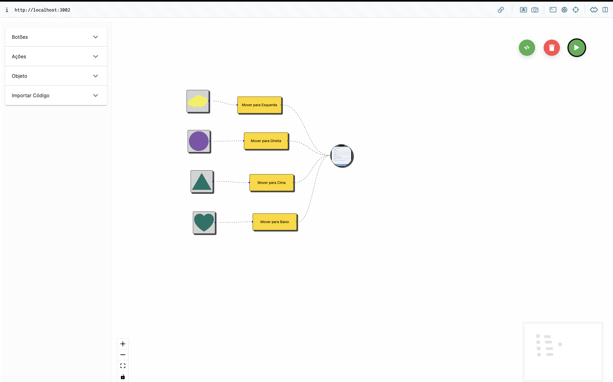
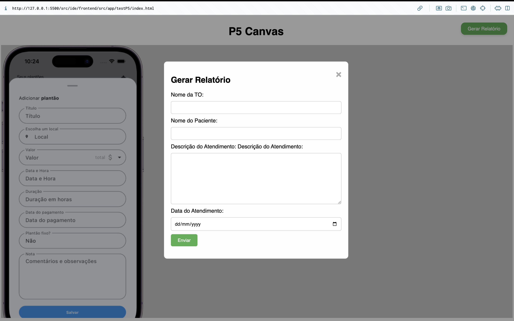

### Desenvolvendo: Uma IDE para Terapeutas Ocupacionais Desenvolverem Jogos para Apoiar o Tratamento de Crianças com TEA

Arthur Tsukamoto Oliveira
Fábio Piemonte Lopes
Guilherme Novaes Lima
Henrique Rodrigues de Godoy
Marcelo Maia Fernandes Filho

# Resumo

Este artigo propõe a concepção e implementação de uma plataforma integrada, composta por um tapete sensorial e uma Integrated Development Environment (IDE), destinada a auxiliar no tratamento de crianças diagnosticadas com Transtorno do Espectro Autista (TEA). O objetivo é estimular tanto os aspectos motores quanto cognitivos das crianças, oferecendo uma abordagem terapêutica personalizada. A IDE é projetada para simplificar o desenvolvimento de jogos, permitindo que terapeutas ocupacionais desenvolvam atividades personalizadas para atender às necessidades individuais de cada paciente. Além disso, a plataforma é equipada com um sistema de monitoramento contínuo do progresso das crianças, permitindo uma avaliação constante durante as sessões terapêuticas.

Palavras-chave: Transtorno do Espectro Autista, Terapia Ocupacional, Tecnologia Assistiva, Desenvolvimento de Jogos, Tapete Sensorial.

# 1 Introdução

O TEA (TEA) emerge como um desafio complexo, demandando uma abordagem integral por parte dos sistemas de saúde e políticas públicas em nível global. No contexto brasileiro, a compreensão abrangente do TEA é ainda incipiente, refletindo-se em dificuldades substanciais tanto no diagnóstico precoce quanto no acesso a intervenções terapêuticas adequadas. Estatísticas recentes estimam que o Brasil seja lar de cerca de 2 milhões de indivíduos com TEA, sendo que mais de 300 mil desses casos estão concentrados exclusivamente no Estado de São Paulo [[1]](#1). Diante deste cenário, a demanda por soluções inovadoras e eficientes torna-se inegável.

A abordagem terapêutica fundamentada no viés lúdico emerge como uma estratégia promissora para mitigar os desafios apresentados pelo TEA [[2]](#2), reconhecendo sua capacidade intrínseca de promover o desenvolvimento holístico das crianças afetadas. Todavia, a eficácia destas intervenções encontra-se diretamente atrelada à sua capacidade de personalização, uma vez que as necessidades e habilidades individuais das crianças com TEA se mostram extraordinariamente diversas.

Neste contexto, o presente estudo propõe uma inovação disruptiva ao unir tecnologia assistiva e terapia ocupacional na concepção de uma plataforma dedicada ao tratamento de crianças diagnosticadas com TEA. Por meio da integração de um tapete sensorial e uma Integrated Development Environment (IDE), esta plataforma visa democratizar o processo de desenvolvimento de jogos terapêuticos personalizados, capacitando terapeutas ocupacionais a criar intervenções adaptadas a cada paciente. Paralelamente, enfrenta-se o desafio da familiarização dos terapeutas ocupacionais com as intricadas nuances da programação e design de jogos, superado pela concepção de uma IDE (Integrated Development Environment) acessível e intuitiva, inclusive para profissionais desprovidos de formação técnica específica. Adicionalmente, a plataforma incorpora um sistema de monitoramento contínuo do progresso do paciente, fornecendo uma avaliação objetiva e dinâmica do impacto terapêutico ao longo do processo de intervenção.

# 2 Trabalhos relacionados

Para entendermos melhor a importância do uso das tecnologias assistivas para crianças com TEA, é de suma importância estudarmos alguns trabalhos relacionados que abordam temas ou assuntos semelhantes. A análise de pesquisas e estudos anteriores permite não apenas um aprofundamento teórico e prático sobre as estratégias já utilizadas, mas também oferece uma diversidade de perspectivas e soluções. Diante disso, diferentes abordagens podem revelar nuances e possibilidades que, quando combinadas, potencializam a criação de ferramentas cada vez mais eficazes e customizáveis, conforme as necessidades específicas do grupo estudado.

No estudo de Pham A.V et al. (2019), foi realizada uma meta-análise que examinou a eficácia de diversas tecnologias no apoio ao desenvolvimento da comunicação em indivíduos com TEA. Entre as tecnologias avaliadas, Dispositivos de Comunicação Geradora de Fala(SGDs), como tablets, destacaram-se por facilitar habilidades de comunicação, especialmente a habilidade de realizar pedidos. Foram também investigadas tecnologias como Comunicação Aumentativa e Alternativa (CAA), interação baseada em visão (Vision Based Interaction) e Realidade Virtual (VR). Estas oferecem métodos alternativos e avançados de comunicação e interação, abrindo novas possibilidades para o tratamento e educação de indivíduos com TEA. Além disso, o estudo concentrou-se principalmente em pesquisas realizadas em ambientes escolares, envolvendo crianças, o que sublinha a importância de integrar essas tecnologias no contexto educacional para maximizar o desenvolvimento comunicativo e social desses alunos. Os resultados do estudo indicaram que os SGDs foram particularmente eficazes, melhorando significativamente as habilidades de comunicação relacionadas a pedidos, com a maioria dos estudos focando nesta habilidade específica. As intervenções baseadas em visão(VBI) também mostraram eficácia no desenvolvimento de habilidades sociais e comunicativas. Contudo, os resultados revelaram que a Realidade Virtual ainda necessita de investigação adicional para determinar sua eficácia a longo prazo. [[3]](#3)

Khowaja K et al. (2019) aborda sistematicamente o uso de realidade aumentada(RA) para aprimorar habilidades de comunicação social em crianças e adolescentes com TEA. O estudo sintentiza diferentes abordagens que podem ser realizadas ao se efetuar uma pesquisa, explorando uma variedade de métodos de coletas de dados(questionários, observações e entrevistas) e diferentes designs de pesquisa(Pre-test, Post-Test, Pre-test and Post-test). Entre as tecnologias empregadas estão videogames como o Xbox 360, o sistema de captura de movimento do Kinect, dispositivos como o Google Glass e tablets, os quais foram utilizadas para criar ambientes imersivos e interativos que facilitam a comunicação e a interação social das crianças. Os resultados do estudo indicam que a realidade aumentada pode ser uma ferramenta eficaz para melhorar as habilidades de comunicação social de crianças com TEA. [[4]](#4)

O estudo "Using Augmented Reality in Patients with Autism: A Systematic Review" por Marto, Almeida e Gonçalves (2019), dá ênfase sobre a utilização da tecnologia de Realidade Aumentada (RA) na reabilitação de pacientes com autismo, explorando diversas tecnologias assistivas como óculos inteligentes, Google Cardboard, Kinect, dispositivos móveis (tablets e smartphones), webcams, telas de computador ou sistemas de projeção de vídeo. A metodologia empregada baseou-se no método PRISMA[[6]](#6) para revisões sistemáticas, com uma busca extensa em várias bases de dados acadêmicas, resultando na análise qualitativa e quantitativa de 16 estudos. A coleta de dados foi realizada por meio de entrevistas, gravação de vídeos, observação direta, questionários e relatórios dos pais das crianças. A maioria dos estudos concentrou-se em crianças e adolescentes com autismo, demonstrando melhorias significativas nas habilidades sociais, de comunicação, atenção e habilidades cognitivas dos pacientes. As aplicações de RA, que integram elementos virtuais e reais em tempo real, ofereceram suporte especialmente para a interação social e a compreensão de expressões faciais e emoções, aspectos frequentemente desafiadores para indivíduos com autismo. No entanto, a revisão também aponta para limitações, como o tamanho reduzido das amostras dos testes realizados e a necessidade de estudos mais aprofundados sobre os efeitos a longo prazo dessas tecnologias. Em conclusão, as implementações de RA apresentam um potencial promissor para melhorar o bem-estar dos pacientes com TEA, incentivando práticas pedagógicas mais inclusivas e interativas. [[5]](#5)

Na fronteira entre o mundo de tecnologia e terapia, Almurashi, H., Bouaziz, R., et al (2022) apresentaram um estudo chamado "Augmented Reality, Serious Games and Picture Exchange Communication System for People with ASD: Systematic Literature Review and Future Directions". O trabalho tem como objetivo explorar profundamente a aplicação prática de tecnologias como Realidade Aumentada (RA), Serious Games (SG) e o Sistema de Comunicação por Troca de Imagens (PECS) no apoio a crianças com TEA. Este estudo destaca-se por ter realizado uma revisão sistemática de estudos que aplicam a abordagem do PECS. Adicionalmente, o trabalho também teve como foco aprimorar e desenvolver soluções prévias, descritas em outros estudos científicos, utilizando as tecnologias previamente citadas. Além disso, ele busca entender fatores comuns entre as tecnologias utilizadas(RA, SG e PECS) para explorar como a integração dessas ferramentas pode potencializar as intervenções destinadas a indivíduos com TEA . Portanto, essa abordagem visa não apenas melhorar as práticas existentes, mas também contribuir para a criação de metodologias mais eficazes e adaptadas às diversas necessidades desses pacientes.[[7]](#7)

Costa, M. S., Costa, V. F. G., e Vieira Junior, N. (2023) referem-se a um estudo de caso sobre o uso do aplicativo SpeeCH como tecnologia assistiva para crianças com TEA. O trabalho ressalta a capacidade da Tecnologia Assistiva (TA) de construir e fornecer subsídios para a autonomia dos estudantes com deficiência em escolas, uma vez que a TA se tornou uma das formas dessas crianças terem acesso ao conhecimento, permitindo que elas interajam entre si, ampliem sua comunicação e cooperação com os outros. Ademais, a TA também pode contribuir para a superação de barreiras (motoras, visuais, auditivas e/ou de comunicação) que, muitas vezes, impedem a aprendizagem dessas crianças.

A principal tecnologia utilizada no estudo foi o SpeeCH, um aplicativo criado por uma equipe do Instituto Federal de Minas Gerais, com o objetivo de ajudar estudantes com TEA a se comunicarem. Ele é composto por uma prancha eletrônica com categorias de fotos temáticas que podem ser acessadas pelo usuário. Ao clicar na imagem, o aplicativo emite um efeito sonoro correspondente à figura apresentada na tela, estimulando a criança a repeti-lo. O aplicativo possui dois portfólios: um com o alfabeto e outro com imagens de animais e seus respectivos sons.

Os resultados obtidos mostraram que, em um primeiro momento, as crianças não se interessavam pelo aplicativo SpeeCH, preferindo acessar outros aplicativos como o YouTube. Entretanto, posteriormente, conforme as crianças foram apresentadas aos portfólios do alfabeto e dos animais, foi observada uma maior interação e autonomia no uso do aplicativo. Dessa forma, os resultados demonstram que o aplicativo SpeeCH pode auxiliar no desenvolvimento da autonomia das crianças com TEA. Contudo, apesar do aplicativo SpeeCH ter promovido a autonomia das crianças, foram identificadas algumas dificuldades no próprio software, como irregularidades na sincronização entre a imagem e o som emitido. [[8]](#8)

Purnama, Y., Hermana, F, et al. (2019). O estudo apresenta o Squizzy, um aplicativo assistivo desenvolvido para tablets, projetado para facilitar a terapia de crianças com TEA em países em desenvolvimento como a Indonésia. Utilizando a metodologia Scrum, o Squizzy foi criado para ser portátil, fácil de usar e útil, incorporando atividades como correspondência de imagens(Image Matching), palavras opostas(Opposite Words), perguntas simples e ordenação de ações, todas com diferentes níveis de dificuldade. A avaliação mostrou feedback positivo, destacando sua simplicidade e eficácia em manter o foco das crianças, além de sua utilidade em indonésio, uma vez que há poucos softwares educacionais no idioma. O Squizzy reduziu a necessidade de ferramentas terapêuticas físicas, mas a presença de terapeutas ou pais ainda é necessária para orientar as crianças e evitar dependências de dispositivos. Pesquisas futuras devem focar em atividades que desenvolvam habilidades motoras. [[9]](#9)

Sumariamente, Esses estudos destacam a importância e o potencial das tecnologias assistivas no apoio ao desenvolvimento de habilidades em crianças com TEA. Esses trabalhos exploram uma variedade de abordagens, incluindo dispositivos de comunicação, realidade aumentada, Serious Games e sistemas de troca de imagens, todos com o objetivo de melhorar a comunicação, interação social e habilidades cognitivas dos indivíduos com TEA. A aplicação dessas tecnologias em contextos educacionais e terapêuticos tem demonstrado resultados promissores. Em particular, a integração de elementos virtuais e reais por meio da realidade aumentada e a utilização de aplicativos interativos como o SpeeCH, Squizzy exemplificam como as inovações tecnológicas podem facilitar a aprendizagem e a autonomia dessas crianças, apesar das limitações e desafios identificados, como a necessidade de estudos mais aprofundados e melhorias na usabilidade dos softwares.

Entretanto, tendo uma visão geral dos estudos relacionados, percebe-se uma lacuna significativa, principalmente em relação à capacidade de personalização das intervenções terapêuticas e de um monitoramento próximo. A maioria das tecnologias assistivas existentes requer um  nível técnico e conhecimentos tecnológicos para serem eficazmente implementadas, o que limita seu uso por terapeutas ocupacionais sem formação específica. Além disso, muitas dessas soluções não oferecem ferramentas para o monitoramento contínuo do progresso dos pacientes, essencial para ajustar as terapias de maneira dinâmica e precisa. Essa falta de uma plataforma altamente personalizável e acessível impede que as intervenções sejam totalmente adaptadas às necessidades individuais das crianças com TEA. Dessa forma, a criação de um tapete sensorial que se integra a um Ambiente de Desenvolvimento Integrado (IDE) diferencia-se significativamente dos trabalhos relacionados devido à sua abordagem holística e altamente personalizável. A IDE foi concebida para ser acessível e intuitiva, permitindo que os terapeutas ocupacionais desenvolvam seus próprios jogos e dinâmicas conforme as necessidades dos pacientes. Ademais, a solução contém um sistema de monitoramento contínuo, que permite que os terapeutas realizem avaliações objetivas das intervenções. Por fim, a capacidade de promover diferentes dinâmicas por meio de um tapete sensorial e um sistema de monitoramento que ajude na personalização e na documentação do progresso do paciente em uma única plataforma destacam a inovação e a eficácia desta proposta para a área de Terapia Assistiva.

# 3 Materiais e Métodos
Este projeto foi desenvolvido utilizando diversas tecnologias e embasamentos diferentes para obter um produto utilizável e que agregasse real valor para os stakeholders. O principal objetivo deste projeto é desenvolver uma IDE integrada a um Compilador, ou seja,
um programa de computador que traduz outros programas de computador[[10]](#10), também conectado a um tapete sensorial conectado ao dispositivo Greg Maker. Inicialmente, utilizou-se um tapete de tecido com fios de cobre, exigindo que a criança usasse uma pulseira metálica para participar. No entanto, optou-se por um tapete em EVA com sensor capacitivo, proporcionando maior conforto e segurança para as crianças. O desenvolvimento do projeto pode ser observado em duas frentes distintas que se conectam posteriormente: IDE e Compilador.

## IDE
Para o Ambiente de Desenvolvimento Integrado, buscou-se tornar o ato de desenvolver código o mais simples e abstraído possível, objetivando a facilidade de uso por parte das terapeutas. Aplicações como "Scratch"[[11]](#11) (uma IDE para que crianças aprendam programação) e "Zapier" (ambiente para integração de aplicações) foram inspirações, pois utilizam o desenvolvimento de código através de blocos.

Este projeto baseou-se no conceito de programação por blocos para o desenvolvimento da IDE. Utilizou-se React, uma biblioteca JavaScript para construção de interfaces de usuário no frontend, e Golang no backend para estruturar essa lógica. Além disso, para concretizar a programação em blocos, utilizou-se a biblioteca React-Flow, responsável pela criação da interface dos blocos e conexão entre eles. No contexto de acessibilidade, aderiu-se às Diretrizes(Compreensível,Robusto,Operável,Perceptível) de Acessibilidade para o Conteúdo da Web (WCAG) para garantir que a IDE seja acessível a uma ampla gama de usuários, incluindo aqueles com diferentes habilidades e necessidades.

Com essas tecnologias, foi construído um whiteboard onde os blocos são colocados e uma sidebar onde os blocos de código ficam disponíveis para serem selecionados. Esses blocos, ao serem criados, armazenam código no banco de dados através do backend. A concretização do uso dessas tecnologias resultou em uma IDE que facilita a produção de código através de blocos, além de mostrar a dinâmica ou jogo criado quando o usuário clica no botão de compilar. Esse processo é possível porque, no frontend, cada tipo de bloco possui um código em FOFI atrelado a ele. Assim, quando o botão de compilar é clicado, as conexões entre os blocos permitem ao frontend gerar um código em FOFI para o jogo, que é enviado ao backend e, posteriormente, ao compilador.



## Compilador
Para o compilador, onde foram desenvolvidos o analisador léxico, sintático e semântico, utilizaram-se diferentes tecnologias para cada etapa.

O analisador léxico foi desenvolvido utilizando a ferramenta ANTLR4, uma biblioteca para criação de compiladores, que possui suporte para a inserção das regras sintáticas e gramaticais da linguagem. O analisador léxico é responsável por ler o código-fonte e dividir o texto em unidades significativas chamadas tokens, que são a menor unidade de significado na linguagem de programação. Com o auxílio do ANTLR4, o grupo gerou o arquivo "fofi.py", utilizado para desenvolver o "analisador_lexico.py". Essa ferramenta foi escolhida com base em autoestudos realizados pelos membros do grupo. O analisador léxico foi implementado na seguinte ordem: criação da gramática FOFI no arquivo fofi.g4, geração do código "fofi.py" a partir da compilação de "fofi.g4" e criação do "analisador_lexico.py" utilizando as funções nativas de "fofi.py".

O analisador sintático e semântico foi desenvolvido em Python, sem a utilização de bibliotecas adicionais.O analisador sintático é responsável por receber os tokens gerados pelo analisador léxico e organizá-los em uma estrutura hierárquica conhecida como árvore sintática, que representa a relação gramatical entre os tokens e verifica se a sequência de tokens respeita as regras da gramática da linguagem FOFI. A implementação baseou-se na sintaxe da gramática FOFI, onde cada função no "analisador_sintatico.py" realiza a análise de determinados tipos de símbolos, sejam eles terminais ou não-terminais.

O analisador semântico é responsável por verificar se a árvore sintática segue as regras semânticas da linguagem, como checagem de tipos, escopo de variáveis e coerência de operações. Este passo garante que as expressões e comandos do código-fonte têm significado válido dentro do contexto da linguagem. Além disso, foi desenvolvida a geração de código em Python, gerando um "output" em JavaScript. Para isso, utilizou-se a árvore sintática, que foi percorrida no arquivo responsável pela geração do código, onde cada método é responsável por percorrer uma determinada parte da árvore sintática e gerar o código correspondente em JavaScript.

O produto da implementação dos analisadores léxico, sintático e semântico foi um compilador capaz de compilar qualquer código em FOFI.AXE e gerar um código em JavaScript, que é retornado ao backend e, posteriormente, ao frontend. A partir dessa conexão obtém-se uma aplicação completa e funcional.

## Aplicação
Em suma, utilizou-se do embasamento citado e das seguintes tecnologias: JavaScript, React, React-Flow, Python, ANTLR4 e WCAG. JavaScript e React foram escolhidos para o frontend devido à sua flexibilidade e suporte a interfaces dinâmicas, enquanto o React-Flow facilitou a criação de um ambiente visual intuitivo para programação em blocos. Python e ANTLR4 foram fundamentais para o desenvolvimento do compilador, garantindo uma análise precisa do código na linguagem FOFI.AXE. As Diretrizes de Acessibilidade para o Conteúdo da Web (WCAG) asseguraram a inclusão e acessibilidade da plataforma.

A integração entre a IDE e o compilador gerou uma plataforma intuitiva e de fácil utilização, especialmente projetada para auxiliar no tratamento de crianças com TEA. A interface gráfica baseada em programação por blocos permite que as crianças aprendam conceitos de programação de forma lúdica e envolvente, contribuindo para o desenvolvimento de habilidades cognitivas e de resolução de problemas. Essa abordagem promove a inclusão digital e o desenvolvimento de competências tecnológicas, resultando em um ambiente educativo inovador e acessível.

## 4 Resultados

### Testes realizados no transpilador

O transpilador foi testado com uma série de códigos escritos na linguagem FOFI, que foram projetados para cobrir uma ampla gama de funcionalidades e complexidades. Os testes incluíram desde estruturas básicas de controle de fluxo, como loops e condicionais, até a manipulação de variáveis e interações entre diferentes blocos de código.

Os testes realizados confirmaram a capacidade do transpilador de converter corretamente o código FOFI em JavaScript. Foram realizados testes para verificar a correta geração de tokens pelo analisador léxico, a construção precisa da árvore sintática pelo analisador sintático e a verificação semântica das operações. Além disso, verificou-se a correta execução do código JavaScript gerado, assegurando que a lógica dos jogos e atividades terapêuticas fosse mantida.

#### Exemplos de Testes

1. **Testes de equações aritméticas:**
    - Código FOFI: 
    ```
    programa
    "Exemplo pequeno de geração de código."
    var
    binario x;
    numero y, z;
    {
        y : 5 - 3 + 4 * 2;
        z : (2 + y) / (9 % 5);
        x : (y ^ z ^ 2 >= 1000) e (y = 10);
        mostrar(x);
    }
    ```
    - Código JavaScript gerado: 
    ```js
    // Código gerado a partir do programa FOFI
    const WIDTH = 1000
    const HEIGHT = 500
    const OBJECTS = []
    const SOUNDLIST = []
    const CANVAS = { bg: "gray", bgType: "color" }
    const MSG = document.getElementById('msg')
    // Inicialização de variáveis
    var     x = false;
    var     y = 0;
    var     z = 0;
    // Início do código
    function setup() {
        createCanvas(WIDTH, HEIGHT);
        background(200);
        let _TEMPVAR1 = 5 - 3;
        let _TEMPVAR2 = 4 * 2;
        let _TEMPVAR3 = _TEMPVAR1 + _TEMPVAR2;
        y = _TEMPVAR3
        let _TEMPVAR4 = 2 + y;
        let _TEMPVAR5 = 9 % 5;
        let _TEMPVAR6 = _TEMPVAR4 / _TEMPVAR5;
        z = _TEMPVAR6
        let _TEMPVAR7 = z ** 2;
        let _TEMPVAR8 = y ** _TEMPVAR7;
        let _TEMP9 = _TEMPVAR8 >= 1000
        let _TEMP10 = y === 10;
        let _TEMPVAR11 = _TEMP9 && _TEMP10;
        x = _TEMPVAR11
        mostrar(x);
        OBJECTS.forEach((obj) => obj.func(obj));
    }
    function preload() {
    }
    ```
    - Resultado: Código executado corretamente, mostrando o valor de `x`.

2. **Testes de Interação de Blocos:**
    - Código FOFI: 
    ```
    programa
    "Exemplo grande de geração de código."
    var
    numero x, obj;
    texto msg;
    {
        msg : "Programar em Fofi é muito fácil";
        x : (2^3^4) / 2;
        se (x*2 > 10-1) {
            obj : criar_imagem("leao.jpg", x*2, 2^5);
        } senao {
            obj : criar_imagem("cachorro.jpg", x+2*3, 100-1);
            x : 1;
            repita(3) {
                mover(obj, x, 99);
                x : x + 10;
            }
        }
    }
    ```
    - Código JavaScript gerado: 
    ```js
    // Código gerado a partir do programa FOFI
    const WIDTH = 1000
    const HEIGHT = 500
    const OBJECTS = []
    const SOUNDLIST = []
    const CANVAS = { bg: "gray", bgType: "color" }
    const MSG = document.getElementById('msg')
    // Inicialização de variáveis
    var     x = 0;
    var     obj = 0;
    var     msg = '';
    // Início do código
    function setup() {
        createCanvas(WIDTH, HEIGHT);
        background(200);
        msg = "programar em fofi é muito fácil";
        let _TEMPVAR1 = 3 ** 4;
        let _TEMPVAR2 = 2 ** _TEMPVAR1;
        let _TEMPVAR3 = _TEMPVAR2 / 2;
        x = _TEMPVAR3
        let _TEMPVAR4 = x * 2;
        let _TEMPVAR5 = 10 - 1;
        let _TEMP6 = _TEMPVAR4 > _TEMPVAR5
        if (_TEMP6) {
        }
        else {
            x = 1
            for (let i = 0; i < 3; i++) {
                mover(obj, x, 99);
                let _TEMPVAR12 = x + 10;
                x = _TEMPVAR12
            }
        }
        OBJECTS.forEach((obj) => obj.func(obj));
    }
    function preload() {
        let _TEMPVAR7 = x * 2;
        let _TEMPVAR8 = 2 ** 5;
        obj = criar_imagem("leao.jpg", _TEMPVAR7, _TEMPVAR8);
        let _TEMPVAR9 = 2 * 3;
        let _TEMPVAR10 = x + _TEMPVAR9;
        let _TEMPVAR11 = 100 - 1;
        obj = criar_imagem("cachorro.jpg", _TEMPVAR10, _TEMPVAR11);
    }
    ```
    - Resultado: A interação entre o tapete sensorial e o jogo funcionou conforme esperado.

### Criação de jogos com blocos

Os terapeutas ocupacionais testaram a criação de jogos utilizando a interface de programação por blocos. A IDE se mostrou eficiente para permitir que usuários sem experiência em programação desenvolvessem atividades terapêuticas personalizadas.

#### Exemplos de Jogos Criados

1. **Jogo de Movimentação:**
    - Objetivo: Mover uma imagem pela tela.
    - Blocos Utilizados: `botão`, `mover`, `objeto`.
    - Resultado: As terapêutas conseguiram seguir a sequência de atividades propostas, reforçando habilidades de ordem lógica.

2. **Jogo de Piano:**
    - Objetivo: Conseguir criar um instrumento musical com o tapete.
    - Blocos Utilizados: `objeto`, `tocar`, `botão`.
    - Resultado: As terapêutas demonstraram melhora e independência ao criarem um jogo.

### Teste de usabilidade

Os testes de usabilidade foram conduzidos com 6 alunas de terapia ocupacional da USP para avaliar a interface e funcionalidade da IDE. As tarefas atribuídas incluíam a criação de jogos simples, conexão de blocos, e uso de diferentes funcionalidades da plataforma.

#### Tarefas Realizadas

1. **Criação de um Jogo Simples:**
    - Os terapeutas foram instruídos a criar um jogo básico que tocasse um som e movesse um objeto no tapete.
    - Percepção: A maioria conseguiu completar a tarefa, mas alguns encontraram dificuldades na conexão dos blocos.

2. **Teste de Funcionalidades Específicas:**
    - Incluiu testar a função de deletar blocos, salvar jogos e adicionar imagens.
    - Percepção: Houve confusão sobre a funcionalidade dos botões, especialmente os de deletar e play.

#### Percepções dos Usuários

- **Complexidade na Conexão dos Nodos:**
    - Problema: Dificuldades em saber onde e como conectar os nodos.
    - Solução: Melhoria na visualização das conexões possíveis, destacando as entradas e saídas quando um nodo é selecionado, e implementação de um tutorial interativo.

- **Usabilidade dos Botões e Funcionalidades:**
    - Problema: Confusão sobre a funcionalidade dos botões.
    - Solução: Redesenho da interface dos botões com ícones intuitivos.

- **Nomenclatura e Conceitos Claros:**
    - Problema: Termos não claros como "mover para X e Y" e "tocar som".
    - Solução: Uso de nomenclaturas mais descritivas e legendas nos nodos.

- **Inclusão de Elementos Visuais (Imagens):**
    - Problema: Dificuldade em encontrar a opção de adicionar imagens.
    - Solução: Tornar o processo mais visível e intuitivo com um ícone na barra de ferramentas principal.

- **Tutorial e Suporte ao Usuário:**
    - Problema: Necessidade de um tutorial.
    - Solução: Desenvolvimento de um tutorial onboarding e vídeos explicativos das principais funcionalidades.

- **Feedback e Reforçamento Positivo:**
    - Problema: Necessidade de feedbacks positivos como "Peppa Pig".
    - Solução: Implementação de feedbacks visuais e sonoros positivos.

#### Melhorias Implementadas

As melhorias sugeridas pelos terapeutas durante os testes de usabilidade foram implementadas na plataforma. Isso inclui a adição de um tutorial, melhoria na visualização das conexões dos nodos e o redesign dos botões com ícones mais intuitivos.

### Fluxograma de como criar um jogo a partir da IDE

Para auxiliar os terapeutas na criação de jogos, foi desenvolvido um fluxograma que detalha os passos necessários:

1. **Seleção dos Blocos Iniciais:**
    - Escolha os blocos que deseja usar.
    

2. **Adição de Imagem e coordenadas ao objeto:**
    - Clique no objeto e adicione uma imagem e uma coordenada.
    

3. **Conexão dos Blocos:**
    - Conecte os blocos de botões ao bloco de ação, e depois os de ação ao de objeto.
    

4. **Visualização do código:**
    - Visualize o código.
    

5. **Teste e Iteração:**
    - Utilize o botão de play para testar o jogo.
    - Faça ajustes conforme necessário, deletando ou adicionando novos blocos.
    

6. **Criação dos relatórios:**
    - Clique em gerar relatório e crie adicione relate a evolução do paciente com a dinâmica.
    


Este fluxograma foi incorporado ao tutorial da plataforma, facilitando a compreensão e utilização da IDE pelos terapeutas ocupacionais.


# 5 Conclusão

Este estudo apresentou o desenvolvimento de uma plataforma que combina um tapete sensorial, uma Integrated Development Environment (IDE) e um compilador que possibilita a simplicidade do desenvolvimento de código pela IDE ser possível, essas três ferramentas foram desenvolvidas e integradas para auxiliar no tratamento de crianças com TEA. A proposta destaca-se pela sua capacidade de personalização, acessibilidade e integração de monitoramento contínuo, elementos que não são plenamente atendidos pelas tecnologias assistivas atuais. Em suma, a aplicação desenvolvida tinha como objetivo permitir que terapeutas ocupacionais pudessem codificar, através de blocos, dinâmicas que irão contribuir para o tratamento de crianças com TEA.

O projeto atingiu seu objetivo principal, como foi demonstrado na seção de resultados, durante os testes de usabilidade as terapeutas puderam desenvolver uma ferramenta que permite aos terapeutas ocupacionais criar atividades terapêuticas de maneira autônoma e inovadora,sem exigências de conhecimento técnico em programação. Tanto a funcionalidade quanto a usabilidade da IDE foram implementadas conforme o planejado. Ainda nesse contexto, em relação aos trabalhos relacionados citados, conseguimos uma melhora em alguns aspectos fundamentais para o tratamento de indivíduos com TEA, principalmente tratando-se de crianças, tais pontos foram: maior personalização e registro das atividades realizadas pelas crianças durante o tratamento. O primeiro aspecto foi uma melhoria em relação ao estudo de Almurashi, H., Bouaziz, R., et al. (2022)[[7]](#7), através da solução desenvolvida a alta personalização agora torna-se tangível, simples de ser feita e eficaz para o tratamento dessas crianças. Ademais, a capacidade de registro e avaliação da seção através da plataforma é um ponto de melhoria em relação a todos os trabalhos relacionados citados, tal aspecto é basilar para a organização e metrificação de progresso durante o tratamento do TEA.

No contexto de continuidade, futuras pesquisas podem explorar várias áreas promissoras:
* Integração com outras ferramentas terapêuticas: Estudar a viabilidade de conectar a IDE com uma variedade maior de dispositivos e ferramentas terapêuticas, ampliando seu uso para diferentes tipos de intervenção.

* Avaliação em diferentes contextos terapêuticos: Investigar a eficácia da IDE integrada ao tapete sensorial em diversos ambientes terapêuticos, como clínicas, escolas e sessões domiciliares, para entender melhor suas potencialidades e limitações.

* Incorporação de tecnologias emergentes: Explorar como a Internet das Coisas (IoT) e a Inteligência Artificial (IA) podem ser integradas à plataforma para aprimorar a eficácia dos tratamentos, facilitar a criação de dinâmicas e melhorar a avaliação do progresso dos pacientes.

Em suma, o projeto alcançou seu objetivo principal ao permitir que terapeutas ocupacionais criem atividades terapêuticas de maneira autônoma e inovadora, sem a necessidade de conhecimentos técnicos em programação. Tanto a funcionalidade quanto a usabilidade da IDE foram implementadas conforme planejado, demonstrando uma melhoria significativa em aspectos fundamentais do tratamento de crianças com TEA, como a personalização das atividades e o registro das sessões.


# Referências 

<a id="1">[1]</a> https://biton.uspnet.usp.br/espaber/?materia=um-retrato-do-autismo-no-brasil#:~:text=Dessa%20forma%2C%20estima%2Dse%20que,sofrem%20para%20encontrar%20tratamento%20adequado.

<a id="2">[2]</a> Abrão, J. L. F (2012). O brincar e suas especificidades em crianças com transtornos invasivos do desenvolvimento: estratégia de intervenção por meio de uma brinquedoteca (pp. 71-90). In: Processos clínicos e saúde mental. São Paulo: Vetor.

<a id="3">[3]</a> Pham, A. V., Bennett, K. D., & Zetina, H. (2019). Technology-Aided Interventions for Individuals With Autism: Implications for Policy and Practice. Policy Insights from the Behavioral and Brain Sciences, 6(2), 202–209. doi:10.1177/2372732219857750 

<a id="4">[4]</a> Khowaja, K., Al-Thani, D., Banire, B., Salim, S. S., & Shah, A. (2019). Use of augmented reality for social communication skills in children and adolescents with autism spectrum disorder (ASD): A systematic review. 2019 IEEE 6th International Conference on Engineering Technologies and Applied Sciences (ICETAS). doi:10.1109/ICETAS48360.2019.9117290

<a id="5">[5]</a> Marto, A., Almeida, H. A., & Gonçalves, A. (2019). Using augmented reality in patients with autism: A systematic review. School of Technology and Management, Computer Science and Communication Research Centre (CIIC), Polytechnic Institute of Leiria. Leiria, Portugal: Polytechnic Institute of Leiria. doi:10.1007/978-3-030-32040-9_46

<a id="6">[6]</a> Liberati, A., et al.: The PRISMA statement for reporting systematic reviews and metaanalyses of studies that evaluate health care interventions: explanation and elaboration. PLoS Med. 6(7), 1–28 (2009) doi:10.1371/journal.pmed.1000100

<a id="7">[7]</a> Almurashi, H., Bouaziz, R., et al (2022). Augmented Reality, Serious Games and Picture Exchange Communication System for People with ASD: Systematic Literature Review and Future Directions. Sensors 2022, 22, 1250. doi:10.3390/s22031250

<a id="8">[8]</a> Costa, M. S., Costa, V. F. G., & Vieira Junior, N. (2023). Uso do aplicativo SpeeCH como tecnologia assistiva para uma criança com transtorno do espectro autista (TEA): um estudo de caso. Revista Educação Especial, 36(1), e8/1–19. https://doi.org/10.5902/1984686X70474

<a id="9">[9]</a> Purnama, Y., Hermana, F. A., Hartono, J., Neilsen, D. S., & Sanjaya, G. (2019). Educational Software as Assistive Technologies for Children with Autism Spectrum Disorder. Procedia Computer Science, 179, 6-16. doi: 10.1016/j.procs.2020.12.002

<a id="10">[10]</a>COOPER, Keith D.; TORCZON, Linda. Engineering a compiler. Morgan Kaufmann, 2022.

<a id="11">[11]</a>SCRATCH: UMA FERRAMENTA CONSTRUCIONISTA NO APOIO A APRENDIZAGEM NO SÉCULO XXI . (2019).

