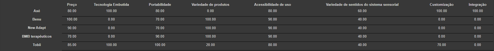
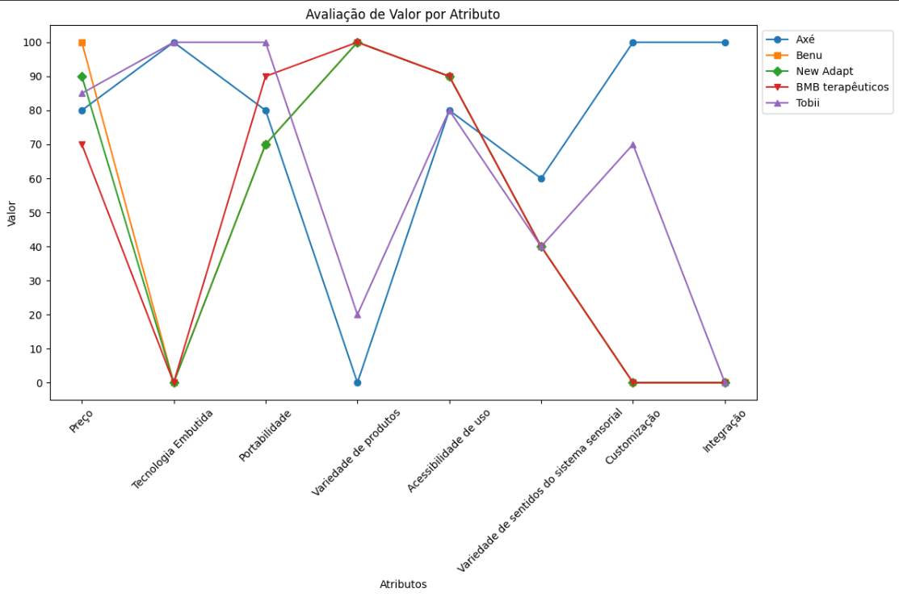
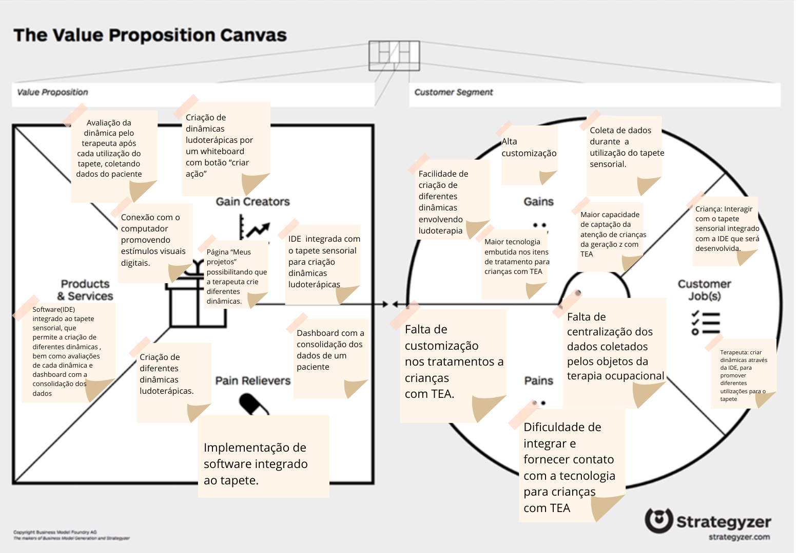
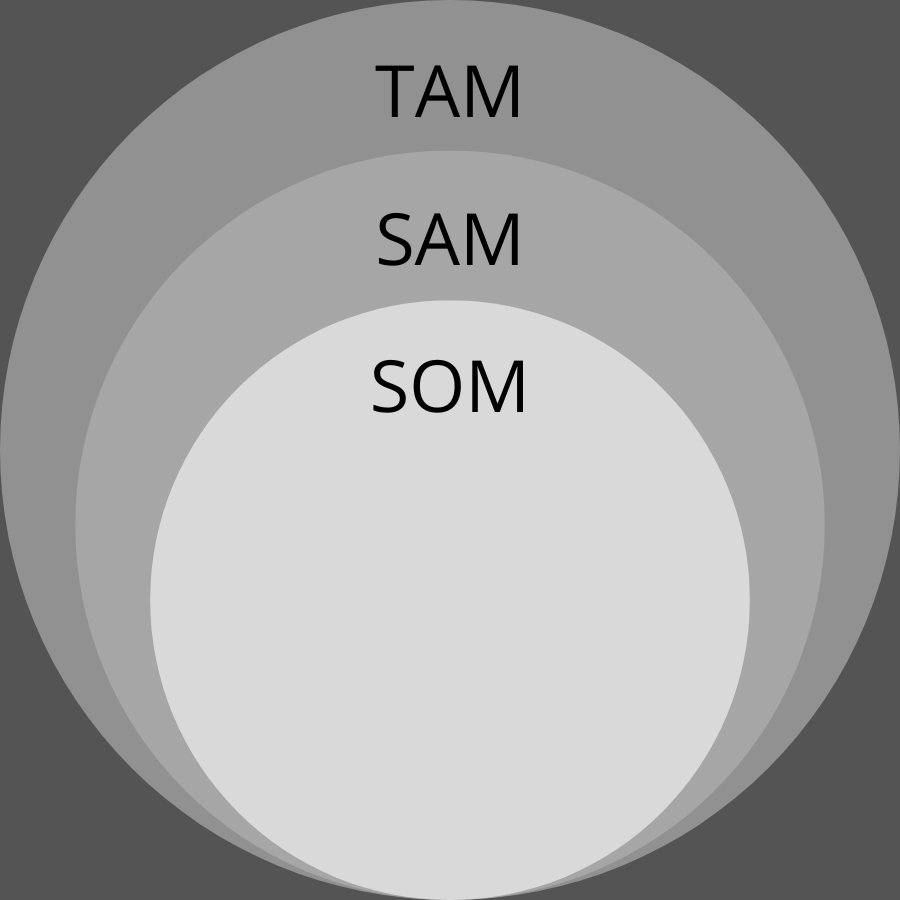
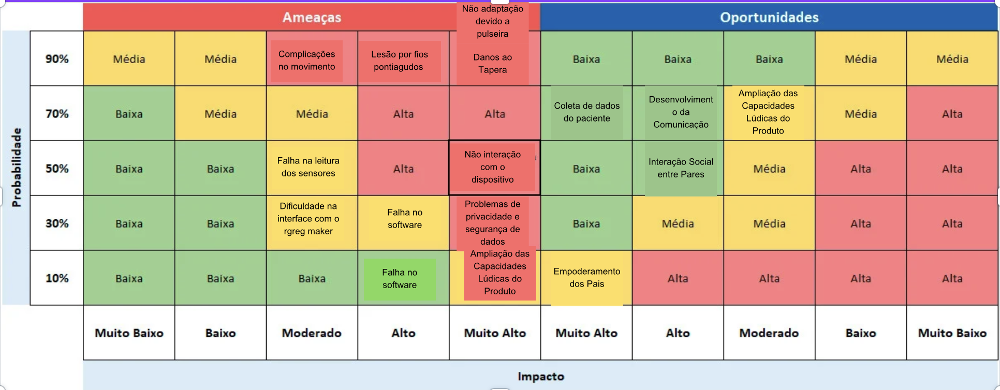

# Entendimento de negócio

Neste artefato, apresentamos uma análise abrangente do negócio, utilizando diversos frameworks, como Oceano Azul, Matriz de Risco, Canvas de Proposta de Valor e Análise Financeira. O objetivo é obter um entendimento mais profundo da empresa com a qual planejamos colaborar. Este documento serve como um recurso para compreender a empresa, suas operações e seu potencial no mercado, fornecendo uma base sólida para futuras decisões e estratégias de negócio.

## Matriz de Oceano Azul

O framework "Oceano Azul" foi desenvolvido por W. Chan Kim e pela Renée Mauborgne em 2005 com a missão de oferecer uma abordagem estratégica inovadora às empresas, incentivando a exploração de novos mercados, em detrimento da concorrência acirrada em mercados saturados. Os criadores, Kim e Mauborgne, propõem que as organizações busquem oportunidades de crescimento em "oceanos azuis", territórios inexplorados e livres de competição. Uma das ferramentas essenciais dentro deste framework é a matriz de Avaliação de Valor, que auxilia as empresas na identificação e exploração de novos mercados, comparando atributos como qualidade, praticidade, custo-benefício e entre outros.

Além disso, para diferenciar as empresas que utilizam-se do "Oceano Azul", é empregada uma estratégia que se resume nas ações: Reduzir, Eliminar, Aumentar e Criar. Essas ações visam diferenciar as empresas e produtos, permitindo que se destaquem em ambientes de mercado não convencionais e inexplorados.

### Reduzir:
Nessa ação, a ideia é reduzir ou simplificar características presentes em produtos ou serviços tradicionais, tendo em vista que a mudança não impacta negativamente o usuário.

### Aumentar:
Nessa ação, o foco está em ampliar os atributos que são valorizados pelos clientes, visando proporcionar maior valor e eficiência do que os concorrentes oferecem aos usuários finais.

### Criar:
Essa ação envolve a criação de um atributo. Ou seja, seria o diferencial da solução em relação aos demais concorrentes.

### Eliminar:
Nessa ação, a estratégia envolve a remoção de atributos que a concorrência pode considerar essenciais, mas que, na realidade, não afetam significativamente o valor percebido pelo cliente.

## Matriz de Avaliação de Valor
Para realizar a avaliação de valor, foram pesquisadas empresas concorrentes que apresentassem semelhanças com a solução proposta.

As empresas analisadas incluem:

**Benu**: Empresa que possui o intuito de proporcionar informações de ponta não somente aos terapeutas de reabilitação infantil, mas também aos professores e familiares de pessoas com diversidade neurológica. Dessa forma, disponibiliza cursos presenciais e online, bem como uma ampla gama de produtos voltados para a psicomotricidade, fisioterapia e terapia ocupacional de crianças com TEA (Transtorno do Espectro Autista). A empresa tem o objetivo de oferecer uma grande variedade de produtos, que vão desde produtos pré-montados e salas sensoriais até piscinas de bolinhas e tapetes sensoriais, incluindo produtos personalizados de acordo com as especificações do cliente.

**New Adapt**: New Adapt tem como objetivo tornar mais acessíveis os recursos de tecnologias assistivas que auxiliem pessoas com deficiência (PCD) no seu desenvolvimento e inclusão na sociedade, com a finalidade de promover melhor qualidade de vida. A New Adapt comercializa produtos para crianças que necessitam de terapia ocupacional e assistiva. O foco da New Adapt está em oferecer mobílias adaptavéis, adequação postual e brinquedos pedagógicos para serem usados nas terapias ocupacionais das crianças com TEA(Transtorno de Espectro Autista) ou com algum tipo de deficiência

**BMB terapêuticos**: Essa Empresa especializa-se na comercialização de produtos relevantes que auxiliam profissionais e familiares que acompanham o dia a dia de pessoas com TEA(Transtorno de Espectro Autista), TDAH(Transtorno do déficit de atenção com hiperatividade), Síndrome de Down e outras condições que apresentam desafios de aprendizado, comportamentais e de desenvolvimento. Ademais, a empresa oferece uma vasta seleção de produtos desenhados especificamente para crianças no espectro autista, com um enfoque especial em estimular os diversos sentidos. A linha inclui produtos que engajam o tato, a visão, e outros sentidos, proporcionando experiências sensoriais ricas que são vitais para o desenvolvimento dessas crianças.

**Tobii**: Uma instituição que oferece soluções completas de tecnologia assistiva, como softwares, tablets, mouses e teclados que são integrados a dispositivos de controle  para pessoas com deficiências diversas, dentre ela o TEA. Dessa forma, por meio dos equipamentos  e software proporcionam melhora na qualidade de vida, com maior liberdade de expressão, comunicação e autonomia. Um exemplo de equipamento é  o Tablet para Comunicação Alternativa Tobii voltado para crianças do TEA que são não verbais.

Com base nessas empresas, criou-se uma tabela com os valores de cada atributo dependendo da empresa. Em seguida, construiu-se um gráfico para que seja possível visualizar as diferenças entre os concorrentes em determinados atributos/características.

Tabela com as notas das empresas concorrentes.

 

Gráfico dos atributos e das respectivas notas das empresas concorrentes.

### Atributos:

**1 - Preço**: Refere-se ao custo de aquisição dos produtos utilizados na terapia assistivas feita pelos consumidores finais ou pelas instituições. Um preço acessível pode tornar o produto mais atraente e disponível para uma gama maior de usuários, incluindo famílias e escolas com orçamentos limitados.

**2 - Tecnologia Embutida**: A Tecnologia embutida refere-se à sofisticação e os tipos de tecnologia incorporadas nos produtos ofertados. A tecnologia embutida deve ser projetada para melhorar a interação do usuário e oferecer experiências sensoriais que são benéficas para o desenvolvimento da criança com TEA(Transtorno de Espectro Autista).   

**3 - Portabilidade**: A portabilidade é à capacidade de transportar facilmente um objeto de um lugar para outro. No contexto da terapia ocupacional, isso significa que o produto deve ser leve, compacto e fácil de dobrar ou desmontar quando necessário.

**4 - Variedade de produtos**: A variedade de produtos refere-se a diversidade dos produtos oferecidos, sendo assim a quantidade de diferentes produtos disponibilizados.

**5 - Acessibilidade de uso**: A Acessibilidade de uso diz respeito a facilidade que o usuário final terá ao utilizar produto de forma independente e segura. No contexto da terapia ocupacional, quanto mais acessível ao uso significa que menos instruções e capacitação prévia deverão ter os indivíduos que lidarão com o produto.

**6 - Variedade de sentidos do sistema sensorial**: A variedade de sentidos do sistema sensorial se refere à capacidade de fornecer informações para diferentes fontes sensoriais, como visão, audição, tato, propriocepção, vestibular, olfato e paladar. Na terapia ocupacional assistiva para crianças com Transtorno do Espectro Autista (TEA), estimular a variedade de sentidos é crucial para o desenvolvimento global da criança.

**7 - Customização**: Esse atributo trata-se da capacidade da solução proposta de ser adaptada às necessidades e preferências individuais de cada criança. A customização pode incluir ajustes na configuração dos estímulos sensoriais, escolha de temas, imagens e sons. Permitir a personalização tem como objetivo tornar o produto mais eficaz e engajante ao usuário.

**8 - Integração**: Refere-se à capacidade das soluções propostas de se integrar com outros dispositivos ou sistemas, como aplicativos móveis, sistemas de monitoramento ou equipamentos utilizados em terapias já existentes.

## Modelo das quatro ações

**Reduzir**: 

***Preço***: Em relação ao atributo preço, considerou-se os valores praticados pelas empresas concorrentes em comparação à nossa solução. Nossa solução, com preço fixado em 850 reais, foi avaliada com nota 80, equivalente à avaliação da Tobii, que comercializa um tablet para crianças com espectro autista por cerca de 900 reais. As empresas Benu e New Adapt, que oferecem uma ampla faixa de preços em seus produtos, variando de 20 reais a 40 mil reais, receberam notas 100 e 90, respectivamente. Enquanto que a empresa BMB foi avaliada com nota 70, pois a maioria de seus produtos situa-se na faixa de preço de 100 a 600 reais. Por fim, nossa solução teve o preço considerado mais acessível em comparação com a maior parte dos concorrentes, resultando em uma redução da nota.

**Aumentar**:

***Tecnologia embutida***: Para o atributo tecnologia embutida, as notas foram atribuídas com base no nível de sofisticação e na variedade das tecnologias incorporadas aos produtos oferecidos. A nossa solução se destaca com a nota máxima de 100, pela utilização do hardware Greg Maker e a interação por meio do computador. A tecnologia embutida na nossa solução tem como objetivo otimizar a interação do usuário e prover experiências sensoriais enriquecedoras, que são fundamentais para o desenvolvimento de crianças com TEA (Transtorno do Espectro Autista). A Tobii igualmente alcançou nota 100, indicando que seus produtos também contam com tecnologias de ponta para atender a esse público específico. Por outro lado, as empresas Benu, New Adapt e BMB não apresentam tecnologias embutidas em seus produtos, recebendo, portanto, a nota 0.

***Portabilidade***: Em relação ao atributo portabilidade, as notas refletem a facilidade com que os produtos podem ser transportados de um lugar para outro. Nossa solução, que consiste em um tapete de dimensões consideráveis, recebeu a nota 80 por ser relativamente grande, o que pode representar um desafio para o manuseio e transporte. A Benu e a New Adapt, com seu amplo espectro de produtos, incluem itens de grande porte que exigem montagem, justificando a nota 70 nesse atributo, uma vez que tais produtos não são os mais práticos para transportar. A BMB, por outro lado, possui diversos produtos de menor porte, o que facilita a portabilidade, conferindo-lhe uma nota alta de 90. Por fim, a Tobii, que oferece um tablet voltado para crianças com espectro autista, destaca-se com uma pontuação de 100, devido ao fato de tablets serem intrinsecamente portáteis, cumprindo com o ideal de ser leve, compacto e de fácil manuseio.

***Acessibilidade de Uso***: Para o atributo Acessibilidade de Uso, foi avaliado o quão fácil é para o usuário final utilizar o produto de maneira independente e segura. Uma alta acessibilidade significa que o produto pode ser usado com o mínimo de instruções e sem necessidade de capacitação prévia. nossa solução e a da Tobii foram avaliadas com uma nota ligeiramente inferior, 80, devido à necessidade de algum conhecimento digital para aproveitar totalmente suas funcionalidades. Isso se deve ao fato de ambos os produtos incorporarem tecnologia avançada que, embora melhore a experiência do usuário, também introduz uma camada de complexidade que pode requerer uma certa familiaridade com dispositivos digitais. Por outro lado, as empresas Benu, New Adapt e BMB receberam notas mais altas, 90, uma vez que seus produtos são completamente físicos e não possuem tecnologia embutida que demande letramento digital.

***Variedade de sentidos do sistema sensorial***: No atributo Variedade de sentidos do sistema sensorial, reflete a capacidade dos produtosde engajar múltiplos sentidos, o que é importante na terapia ocupacional para crianças com Transtorno de Espectro Autista. Em vista disso, nossa solução obteve a nota 60 por ser capaz de estimular três sentidos fundamentais: tato, audição e visão. Já, as empresas concorrentes Benu, New Adapt, BMB e Tobii receberam notas uniformes de 40, pois seus produtos se concentram em estimular dois sentidos: visão e tato. Embora esses sentidos sejam críticos, a falta de estímulo para outros sentidos, como a audição, limita a experiência sensorial que seus produtos podem proporcionar. Portanto, apesar de úteis, essas soluções oferecem um espectro mais estreito de estímulos sensoriais.

**Criar**:

***Customização***:

O atributo Customização refere-se à capacidade em que a solução pode ser personalizada para atender às necessidades e as preferências únicas de cada criança. No caso, a Customização foi um atributo criado pela nossa solução. A nossa solução recebeu a pontuação máxima de 100, pois planejamos implementar nosso tapete sensorial em um ambiente de desenvolvimento integrado(IDE) que dará aos terapeutas e aos pais a liberdade de customizar as dinâmicas para se adequarem especificamente às necessidades de cada sessão da terapia. Enquanto isso, as outras empresas como Benu, New Adapt, BMB e Tobii não oferecem esse nível de customização em seus produtos, o que resulta na nota 0 para elas. Isso significa que os produtos delas têm configurações e funcionalidades fixas, sem a mesma flexibilidade para ajustes conforme as preferências ou necessidades específicas das crianças

***Integração***:  O atributo Integração está diretamente relacionado à capacidade do produto de integrar-se com o ambiente de desenvolvimento integrado(IDE) criado. Nossa solução recebeu a nota máxima, pois é a unica solução que apresenta uma integração com a IDE, enquanto que as outras empresas concorrentes não possuem a integração. Dessa forma, todas as outras empresas receberem 0 como nota. A integração é um atributo importante, pois ele permite que as terapeutas e os pais possam personalizar as dinâmicas realizadas com as crianças, permitindo que cada criança tenha sua própria dinâmica.

**Eliminar**:

***Variedade de produtos***: Em relação ao atributo Variedade de Produtos, as notas foram atribuídas conforme a gama de produtos disponibilizados pelas empresas. Nossa solução recebeu a nota 0, pois o foco está exclusivamente em um único produto: o tapete sensorial com tecnologia avançada. Isso reflete uma especialização em detrimento da variedade. Por outro lado, as empresas Benu, New Adapt e BMB alcançaram a nota máxima de 100, reconhecendo a grande variedade de mais de 50 produtos que elas comercializam, todos voltados para terapia ocupacional ou terapia assistiva, atendendo a uma série de necessidades diferentes nesse campo. Tobii, com uma abordagem mais focada, obteve a nota 20, visto que oferece um espectro limitado de produtos para tais terapias, com destaque para o seu tablet projetado especificamente para crianças com transtorno do espectro autista.

## Análise Financeira

Nesse seção está sendo feita a análise financeira considerando que o grupo atuaria como uma empresa que venderia os tapetes sensoriais integrados com o software(IDE) que será desenvolvido.

Em relação aos custos, consideramos dois tipos de custos, hardware e software, dessa maneira foram pesquisados e quais materiais serão utilizados no desenvolvimento do tapete sensorial e os componentes necessários para a integração. Além disso também foi considerado o custo de 4 desenvolvedores, esse custo de software é gasto uma única vez, diferentemente de hardware que é gasto cada vez que um tapete é produzido, sendo assim considera-se que o custo de software será diluído dentre as vendas da empresa, as quais estima-se 1000(mil) unidades.Assim, em suma o custo total de cada tapete será o custo de hardware somado ao custo diluído do software.

No contexto de receita, buscando uma margem de lucro de 20% estima-se que o preço de venda do tapete seria R$ 1.075,00. A partir do preço de venda calcula-se a receita, CVM , Lucro Bruto, Lucro Líquido e Margem Líquida.

A análise financeira encontra-se no arquivo "Análise Financeira - GuiadosPeloAxé.xlsx".

## Canva Proposta de valor
 O Canvas Proposta de Valor é uma forma de analisar o consumidor, entendendo suas dores e necessidades, mas também analisa a solução, tendo em vista que também serão desenvolvidos os produtos e serviços, aliviadores das dores e também os criadores de ganho. Dessa forma, essa é uma ferramenta muito importante no entendimento de negócio.

 
 

## TAM, SAM, SOM

O objetivo principal da metrificação TAM, SAM, SOM é o de ter uma ideia sobre o valor que o público-alvo do produto ou serviço distribuído pela empresa pode trazer. Isso pode ser muito importante na questão de inteligência de negócios, no marketing, por exemplo, ele pode trazer informações importantes sobre o perfil do cliente que deve ser adquirido e/ou mantido, no âmbito da gestão, também, o TAM, SAM e o SOM são um recurso muito utilizado para a construção de metas, por já indicar uma ideia do potencial que uma empresa tem nos seus próximos anos de atuação.

É importante mencionar que, na representação de conjuntos, a seguinte figura consegue ilustrar a relação entre essas três métricas:

    

    
Fonte: Elaboração dos autores

É perceptível então que o SOM é um subconjunto de SAM, que é, por sua vez, um subconjunto de TAM.

### TAM

O TAM, ou Mercado Total Disponível, para o tapete sensorial abarca o amplo espectro de potenciais consumidores e instituições interessadas no produto, considerando seu público-alvo e sua aplicabilidade. Este mercado engloba não somente crianças em estágios iniciais de desenvolvimento e aquelas diagnosticadas com Transtorno do Espectro Autista (TEA) no Brasil, mas também suas famílias, estabelecimentos educacionais, clínicas terapêuticas e profissionais que se dedicam à terapia ocupacional assistiva. É crucial ressaltar que a amplitude deste mercado reflete a diversidade de consumidores e instituições em busca de soluções que promovam o desenvolvimento e o bem-estar dessas crianças.

O cálculo do TAM pode ser obtido multiplicando-se o número de crianças com idades entre 4 e 7 anos diagnosticadas com TEA no Brasil pela porcentagem correspondente da população com TEA, e pelo valor unitário do tapete sensorial.

Número de crianças com autismo: 7.556.858 [1]
Porcentagem da população com TEA no Brasil: 2,78% [2]
Valor do Tapete Sensorial: R$ 1.031,02

Valor Total do TAM: R$ 216.597.354

### SAM

O SAM, ou Mercado Disponível Viável, representa a parcela do TAM que a empresa pode efetivamente alcançar e atender com sua estratégia de marketing e distribuição. Para este produto específico, o SAM consiste na porção do mercado composta por crianças diagnosticadas com Transtorno do Espectro Autista (TEA) que são acessíveis à empresa no Brasil. Esta categoria inclui não apenas as crianças em si, mas também suas famílias, instituições educacionais e terapeutas que lidam com terapia ocupacional assistiva. Este segmento do mercado é caracterizado pela acessibilidade aos canais de distribuição da empresa e pelo interesse em investir em produtos como o tapete sensorial com tecnologia avançada fornecido pela empresa.

O cálculo do SAM pode ser realizado considerando o número de clínicas que oferecem tratamento para TEA no Brasil, multiplicado pelo valor unitário do tapete sensorial.

Número de clínicas de assistência a TEA: 650 [3]
Valor do Tapete Sensorial: R$ 1.031,02

Valor Total do SAM: R$ 670.163

### SOM

O SOM, ou Mercado Obtenível e Acessível, representa a parte do SAM que a empresa pode efetivamente conquistar e manter como sua participação de mercado. Para este produto, o SOM é definido como a porção do mercado composta por crianças diagnosticadas com Transtorno do Espectro Autista (TEA) que são atendidas por clínicas em São Paulo, considerando os recursos disponíveis da empresa, como capacidade de produção, força de vendas e estratégias de marketing. Este cálculo leva em conta fatores como a aceitação do produto pelo mercado, sua competitividade em relação a outras soluções disponíveis e a capacidade da empresa de atender às necessidades das clínicas terapêuticas de forma eficaz. O SOM é uma medida realista e alcançável da participação de mercado que a empresa pode obter dentro deste segmento específico de crianças com TEA atendidas por clínicas em São Paulo. À medida que a empresa cresce e aprimora suas estratégias, o SOM pode expandir-se para capturar uma fatia ainda maior deste mercado.

O cálculo do SOM pode ser determinado pelo número de clínicas em São Paulo, ajustado pela proporção do PIB de São Paulo em relação ao PIB nacional, e multiplicado pelo valor unitário do tapete sensorial.

Proporção do PIB de São Paulo em relação ao PIB nacional: 7%
Número aproximado de clínicas em São Paulo: 650 * 7% ≈ 50 [4]
Valor do Tapete Sensorial: R$ 1.031,02

Valor Total do SOM: R$ 51.550

# Matriz de Risco do Projeto de IDE para Terapia Ocupacional com Crianças Transtorno de Espectro Autistas

## Riscos Identificados

1. **Lesão por fios pontiagudos de cobre** - Altamente provável e de impacto alto.
2. **Não adaptação devido a pulseira** - Moderadamente provável e de impacto médio.
3. **Falhas na leitura de sensores devido a mau contato** - Moderadamente provável e de impacto médio.
4. **Complicações no movimento devido ao uso da pulseira** - Provável e de impacto médio.
5. **Dano ao tapete por uso intensivo ou inadequado** - Provável e de impacto alto.
6. **Sobrecarga elétrica ou curto-circuito** - Pouco provável, mas de impacto muito alto.
7. **Falha no software ou na linguagem de programação customizada** - Moderadamente provável e de impacto alto.
8. **Dificuldades na interface com o Greg Maker** - Moderadamente provável e de impacto médio.
9. **Interações inesperadas com outros dispositivos eletrônicos na UBS** - Pouco provável e de impacto médio.
10. **Problemas de privacidade e segurança de dados** - Pouco provável e de impacto alto.

## Matriz de Risco

| Risco                                          | Probabilidade | Impacto | Categoria     |
|------------------------------------------------|---------------|---------|---------------|
| Lesão por fios pontiagudos                     | Alta          | Alto    | Crítico       |
| Não adaptação devido a pulseira                | Moderada      | Médio   | Significativo |
| Falhas na leitura de sensores                  | Moderada      | Médio   | Significativo |
| Complicações no movimento                      | Alta          | Médio   | Significativo |
| Dano ao tapete                                 | Alta          | Alto    | Crítico       |
| Sobrecarga elétrica ou curto-circuito          | Baixa         | Muito Alto | Crítico    |
| Falha no software                              | Moderada      | Alto    | Crítico       |
| Dificuldades na interface com o Greg Maker     | Moderada      | Médio   | Significativo |
| Interações inesperadas com dispositivos        | Baixa         | Médio   | Moderado      |
| Problemas de privacidade e segurança de dados  | Baixa         | Alto    | Crítico       |

## Estratégias de Mitigação

- **Para os fios pontiagudos**: Substituir por materiais não condutores onde possível, ou garantir que todos os fios estejam bem isolados e protegidos.
- **Não adaptação devido a pulseira**: Tentar mudar a necessidade da pulseira na próxima iteração com o produto.
- **Falhas na leitura de sensores**: Manter um plano de manutenção regular para o tapete e seus componentes.
- **Complicações no movimento**: Redesenhar a pulseira para permitir maior liberdade de movimento.
- **Dano ao tapete**: Utilizar materiais mais resistentes e criar protocolos de uso adequado para o tapete.
- **Sobrecarga elétrica**: Implementar sistemas de proteção contra sobrecarga e realizar inspeções regulares.
- **Falha no software**: Testes contínuos do software, incluindo testes de usabilidade e funcionalidade.
- **Dificuldades na interface com Greg Maker**: Assegurar a compatibilidade e realizar testes frequentes entre o tapete e o Greg Maker.
- **Interações com dispositivos**: Estabelecer uma área controlada onde outros dispositivos eletrônicos sejam limitados ou proibidos durante o uso.
- **Problemas de privacidade e segurança**: Implementar protocolos de segurança de dados rigorosos e realizar auditorias regulares.

## Oportunidades de Desenvolvimento

### 1. **Coleta e Análise de Dados do Paciente**
- **Oportunidade:** Integrar funcionalidades de coleta de dados no tapete, capturando informações sobre as interações da criança durante as sessões de terapia.
- **Justificativa:** Permite aos terapeutas acompanhar o progresso e ajustar as abordagens terapêuticas de forma mais precisa e baseada em evidências.

### 2. **Ampliação das Capacidades Lúdicas do Produto**
- **Oportunidade:** Enriquecer o tapete com recursos interativos adicionais como jogos, música e elementos visuais que podem ser ativados durante o uso.
- **Justificativa:** Torna as sessões mais envolventes e divertidas, incentivando a participação ativa das crianças.

### 3. **Desenvolvimento da Comunicação**
- **Oportunidade:** Implementar recursos no tapete que promovam a comunicação verbal ou não verbal, como símbolos pictóricos ou respostas de áudio.
- **Justificativa:** Ajuda na melhoria das habilidades comunicativas das crianças autistas, facilitando a expressão de necessidades e sentimentos.

### 4. **Interação Social entre Pares**
- **Oportunidade:** Desenvolver funcionalidades que permitam atividades em grupo no tapete, incentivando a interação entre várias crianças simultaneamente.
- **Justificativa:** Fomenta habilidades sociais essenciais, como compartilhar, esperar a vez e cooperar com os outros.

### 5. **Empoderamento dos Pais**
- **Oportunidade:** Criar um sistema de feedback e visualização de progresso acessível aos pais, mostrando as conquistas das crianças.
- **Justificativa:** Auxilia os pais a compreenderem os avanços dos filhos, reduzindo a superproteção ao verem a capacidade de autonomia e sucesso das crianças.

## Tabela de Probabilidade e Impacto

| Oportunidade                                         | Probabilidade | Impacto   | Prioridade  |
|------------------------------------------------------|---------------|-----------|-------------|
| Coleta e Análise de Dados do Paciente                | Média         | Alto      | Alta        |
| Ampliação das Capacidades Lúdicas do Produto         | Alta          | Médio     | Média       |
| Desenvolvimento da Comunicação                       | Alta          | Alto      | Alta        |
| Interação Social entre Pares                         | Média         | Alto      | Alta        |
| Empoderamento dos Pais                               | Baixa         | Alto      | Média       |

## Referências

http://pepsic.bvsalud.org/scielo.php?script=sci_arttext&pid=S1519-03072017000200008#:~:text=RESULTADOS%3A%20verificaram%2Dse%20650%20institui%C3%A7%C3%B5es,%2Djuvenil%2DCAPSIs%20e%20AMAs.

[1] IBGE dados crianças com autismo

[2]  https://www.google.com/search?q=porcentagem+pessoas+com+tea+no+brasil&oq=porcentagem+pessoas+com+tea+no+brasil&gs_lcrp=EgZjaHJvbWUyBggAEEUYOdIBCDQ1MjRqMGoxqAIAsAIA&sourceid=chrome&ie=UTF-8

[3] http://pepsic.bvsalud.org/scielo.php?script=sci_arttext&pid=S1519-03072017000200008#:~:text=RESULTADOS%3A%20verificaram%2Dse%20650%20institui%C3%A7%C3%B5es,%2Djuvenil%2DCAPSIs%20e%20AMAs.

[4] https://pt.wikipedia.org/wiki/Lista_de_munic%C3%ADpios_de_S%C3%A3o_Paulo_por_PIB

