# Passo a Passo - Funcionamento do Frontend

## Inicialização

Para iniciar o Frontend, precisamos seguir um passo a passo:

**Passo 1**:

Vá até o diretório /src/ide/frontend

```
cd /src/ide/frontend
```

Digite o comando, npm i.

```
npm i
```

Depois do comando npm i, devemos utilizar o comando npm run dev -- -p3002.

```
npm run dev -- -p3002
```

Esse comando fará com que o frontend inicie na porta 3002 do computador.

**Passo 2**:

 Depois de iniciar o front, devemos iniciar outro serviço, que se encontra no mesmo path. Para isso crie um novo terminal e vá ao mesmo path(/src/ide/frontend).

Quando chegar em /src/ide/frontend, digite o seguinte comando.

```
node rotinha.js
```

Esse serviço é responsável por fazer o download das imagens e sons que podem ser, eventualmente, utilizados nas dinâmicas.

**Passo 3**:

Por fim, o ultimo elemento necessário para o frontend funcionar é o backend. Para isso devemos entrar no path /src/ide/backend/docker.

Para rodar o backend, é necessário ter o Docker Desktop instalado, caso não tenha, acesse esse link: https://www.docker.com/products/docker-desktop/

Com o docker desktop instalando, utilizamos os seguintes comandos no terminal:

```
docker build -t guilhermenl/axe-backend:latest .
```
```
docker compose up
```

Com isso, nosso backend estará atualizado e funcionando.

obs: O docker desktop deve estar aberto.

## Funcionamento da IDE

Para abrir o frontend, acesse http://localhost:3002/ em algum navegador.

<div style="text-align: center;">
  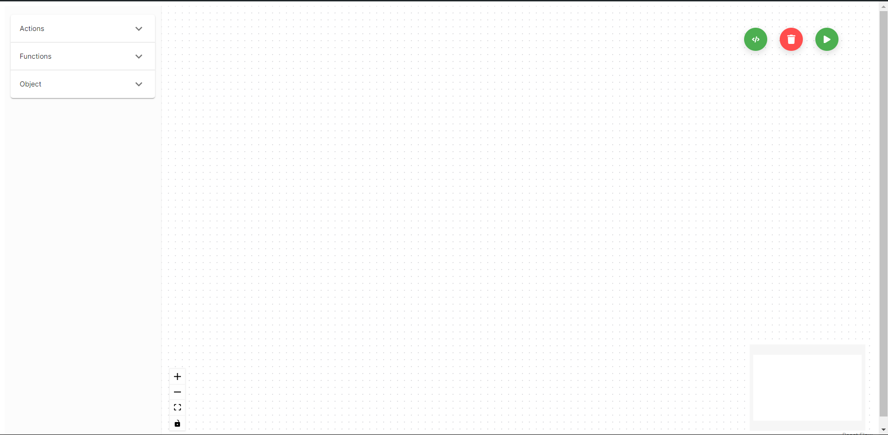
  <p><em>Frontend</em></p>
</div>

O Ambiente de Desenvolvimento consiste em um modelo de programação em bloco, dividido em 3 Etapas principais:

**Ação**:

O bloco de Ação refere-se a um quadrante do tapete sensorial construído. Portanto, terá disponível, apenas, 9 blocos desse tipo na IDE.

<div style="text-align: center;">
  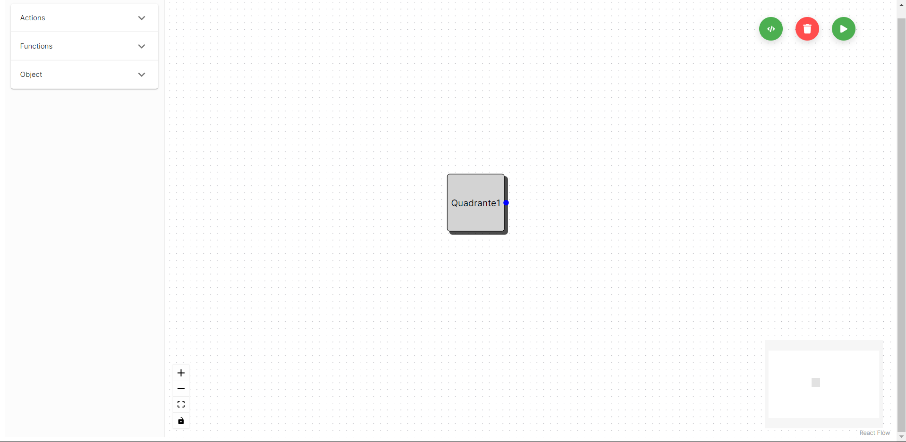
  <p><em>Quadrantes no Canva</em></p>
</div>

Cada bloco de Ação só pode se conectar exclusivamente com um/ ou mais blocos de Reação.

**Reação**:

O bloco de Reação consiste em alguma função built-in que existe dentro da Linguagem de Programação criada ao longo do projeto.

<div style="text-align: center;">
  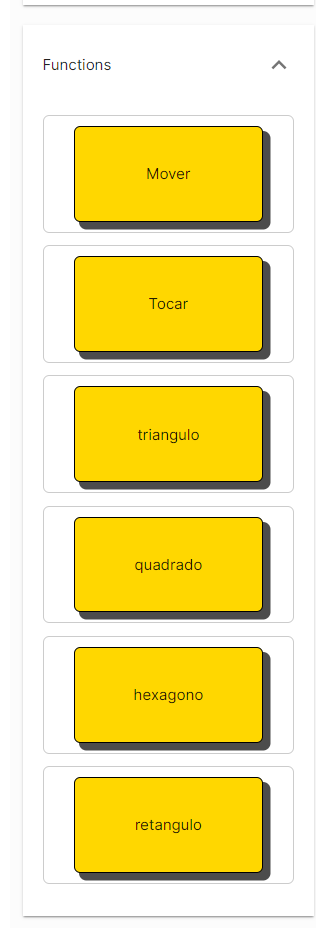
  <p><em>Blocos Reação</em></p>
</div>

<div style="text-align: center;">
  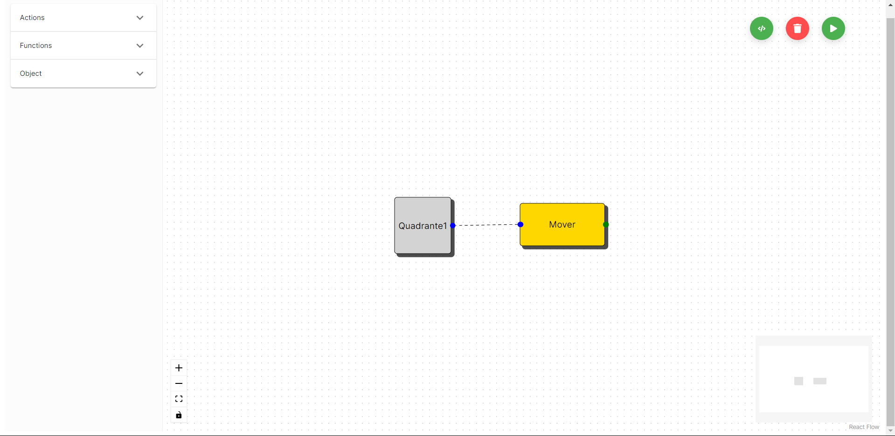
  <p><em>Ação-Reação</em></p>
</div>

Cada bloco de Reação possui propriedades próprias, que devem ser configuradas clicando no bloco.

<div style="text-align: center;">
  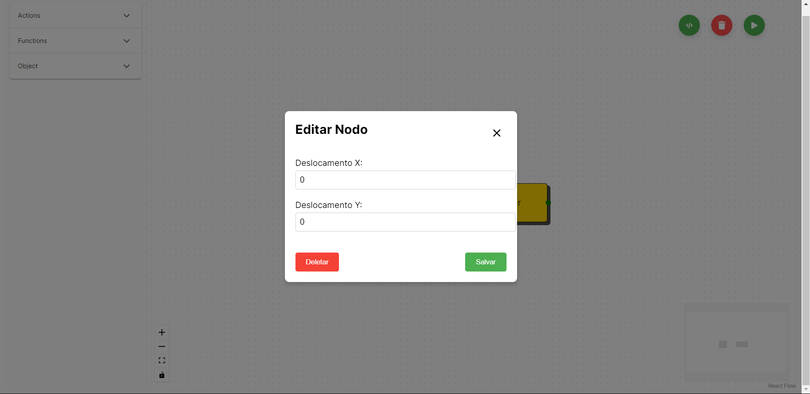
  <p><em>Configuração Bloco Mover</em></p>
</div>

Mais de um bloco de Reação conseguem se conectar, apenas, com um objeto.

**Objeto**:

Por fim, o último componente é o objeto, que pode ser tanto uma imagem, um som ou ambos (imagem com som).

<div style="text-align: center;">
  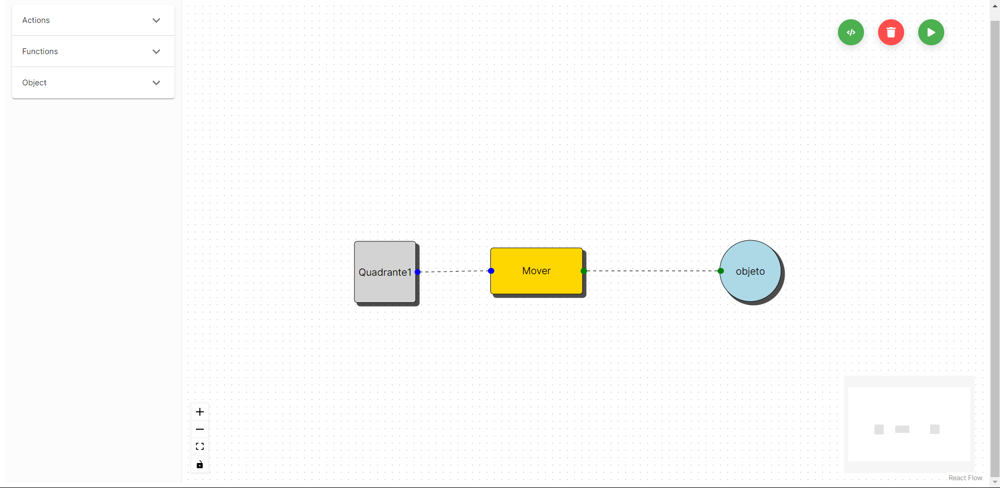
  <p><em>Bloco Objeto</em></p>
</div>

Cada bloco de Objeto tem a possibilidade de incluir uma imagem ou som, por meio de um modal.

<div style="text-align: center;">
  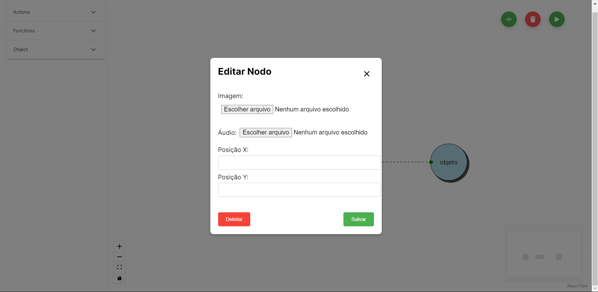
  <p><em>Modal do Objeto</em></p>
</div>

Selecionando uma imagem ou um som, o background do objeto irá mudar, facilitando a identificação de qual objeto aquele bloco representa.

<div style="text-align: center;">
  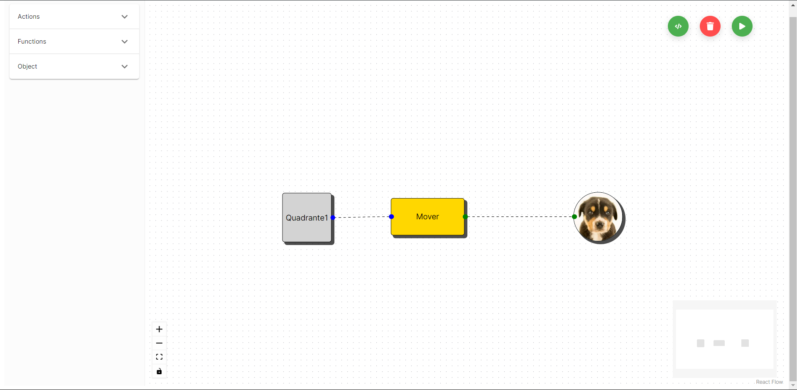
  <p><em>Objeto do Cachorro</em></p>
</div>

Conforme o usuário vai adicionando mais blocos e conectando-os, vai-se criando um código na linguagem Axé, que é possível visualizar no botão de preview.

<div style="text-align: center;">
  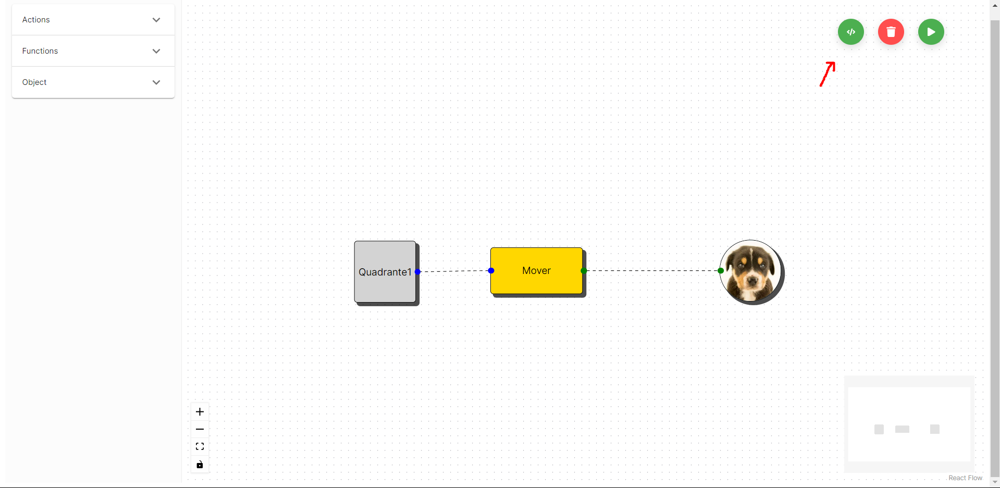
  <p><em>Botão Preview</em></p>
</div>

<div style="text-align: center;">
  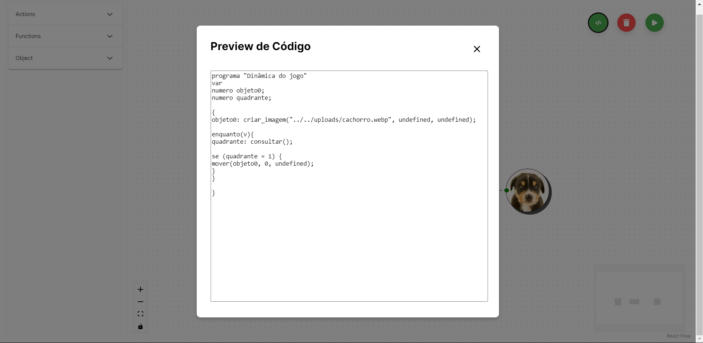
  <p><em>Modal do Preview</em></p>
</div>

Além do botão de preview, temos o botão de deletar e o botão para enviar o código gerado para o compilador.

<div style="text-align: center;">
  
  <p><em>Botão Deletar e Botão Compilador</em></p>
</div>

**Deletar Blocos**:

Ao clicar no botão de deletar, você poderá visualizar quais componentes podem ser deletados. Para os blocos, aparecerá um "X" vermelho indicando que eles podem ser removidos. Já para as arestas, elas ficarão com uma coloração avermelhada. Para deletar as arestas, basta clicar nelas.

<div style="text-align: center;">
  
  <p><em>Deletando Blocos</em></p>
</div>

**Compilar o código**:

Por fim, temos o botão que irá chamar o compilador, para transcrever o nosso código gerado em axe(FOFI) para javascript, para isso ele irá passar pelos analisadores léxico, sintático e semântico.

<div style="text-align: center;">
  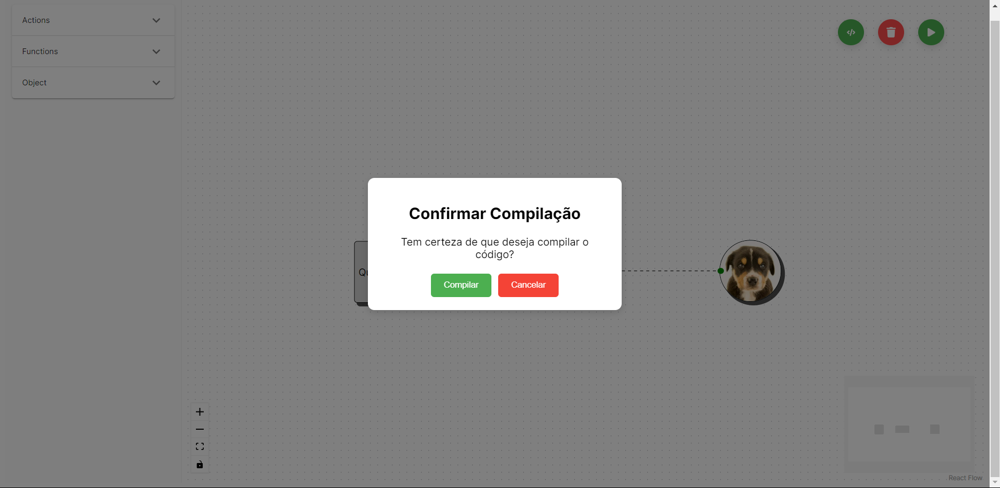
  <p><em>Modal Confirmação do Compilador</em></p>
</div>

Até o momento, o resultado que retornará será a árvore do analisador sintático, para conseguir visualizar o gerador de código e verificar a transformação do código AXE para Javascript, devemos seguir outros passos.

<div style="text-align: center;">
  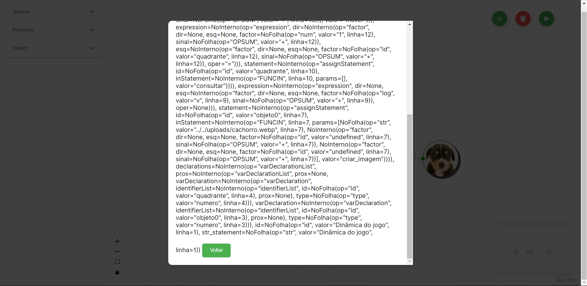
  <p><em>Árvore do Analisador Sintático</em></p>
</div>

## Uso dos Analisadores(Léxico, Sintático e Semântico) e do Gerador de Código.

Para facilitar, utilizaremos o código AXE gerado nos últimos passos realizados

**Código gerado**:
```
programa "Dinâmica do jogo"
var
numero objeto0;
numero quadrante;

{
objeto0: criar_imagem("../../uploads/cachorro.webp", undefined, undefined);

enquanto(v){
quadrante: consultar();

se (quadrante = 1) {
mover(objeto0, 20, 20);
}
}

}
```

Com o código em mãos, precisamos abrir um terminal.

<div style="text-align: center;">
  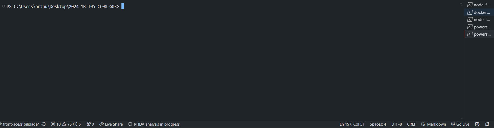
  <p><em>Terminal</em></p>
</div>

No terminal, é necessário chegar até o diretório compiler, para isso, utilizamos o seguinte comando:

```
cd /src/compiler
```

<div style="text-align: center;">
  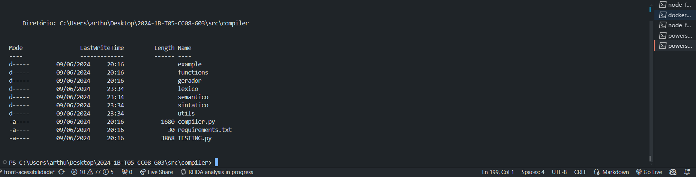
  <p><em>Diretório do Compilador</em></p>
</div>

Para a próxima etapa, precisamos do python instalado, caso não tenha, acesse esse link: https://www.python.org/downloads/

Com o python baixado, usaremos o seguinte comando:

```
python .\compiler.py sintatico
```

<div style="text-align: center;">
  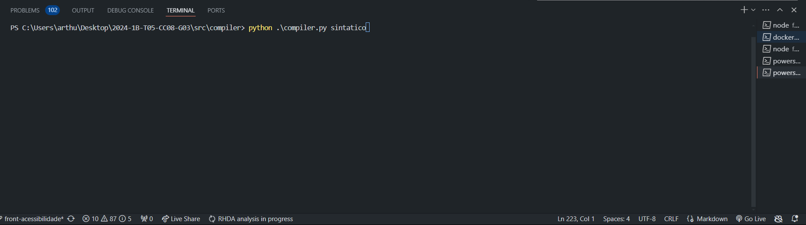
  <p><em>Chamando o Compiler</em></p>
</div>

Dando "Enter", iremos colar o código em AXE que foi gerado lá no Frontend.

<div style="text-align: center;">
  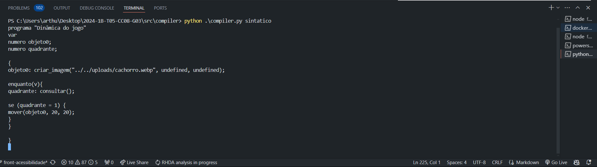
  <p><em>Código AXE no compilador</em></p>
</div>

É necessário dar outro "Enter" e logo em seguida digitamos .EOF.

<div style="text-align: center;">
  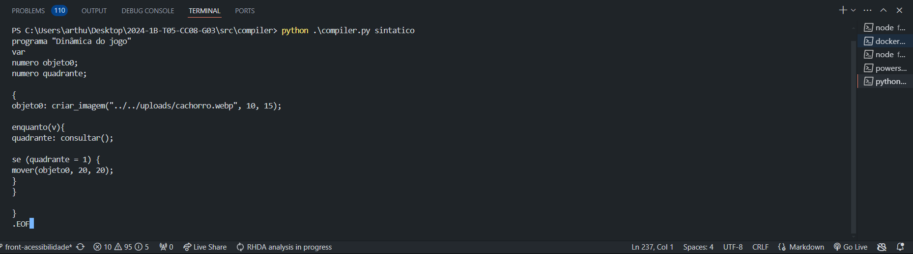
  <p><em>Adição do End of File</em></p>
</div>

Novamente, com outro "Enter", irá gerar uma árvore sintática no terminal.

**Árvore Gerada**:

```
NoInterno(op="alg", 
str_statement=
    NoFolha(op="str", valor="Dinâmica do jogo", linha=1),
block=
    NoInterno(op="block",
    statementList=
        NoInterno(op="statementList",
        statement=
            NoInterno(op="assignStatement",
            id=
                NoFolha(op="id", valor="objeto0", linha=7),
            inStatement=
                NoInterno(op="FUNCIN",
                valor=
                    "criar_imagem",
                linha=
                    7,
                params=
                    [NoFolha(op="str", valor="../../uploads/cachorro.webp", linha=7), NoInterno(op="factor", sinal=NoFolha(op="OPSUM", valor="+", linha=7), esq=None, dir=None, factor=NoFolha(op="num", valor="10", linha=7)), NoInterno(op="factor", sinal=NoFolha(op="OPSUM", valor="+", linha=7), esq=None, dir=None, factor=NoFolha(op="num", valor="15", linha=7))]
                )
            ),
        prox=
            NoInterno(op="statementList",
            statement=
                NoInterno(op="WhileStatement",
                expression=
                    NoInterno(op="expression",
                    oper=
                        None,
                    esq=
                        NoInterno(op="factor",
                        sinal=
                            NoFolha(op="OPSUM", valor="+", linha=9),
                        esq=
                            None,
                        dir=
                            None,
                        factor=
                            NoFolha(op="log", valor="v", linha=9)
                        ),
                    dir=
                        None
                    ),
                block=
                    NoInterno(op="block",
                    statementList=
                        NoInterno(op="statementList",
                        statement=
                            NoInterno(op="assignStatement",
                            id=
                                NoFolha(op="id", valor="quadrante", linha=10),
                            inStatement=
                                NoInterno(op="FUNCIN",
                                valor=
                                    "consultar",
                                linha=
                                    10,
                                params=
                                    []
                                )
                            ),
                        prox=
                            NoInterno(op="statementList",
                            statement=
                                NoInterno(op="ifStatement",
                                expression=
                                    NoInterno(op="expression",
                                    oper=
                                        "=",
                                    esq=
                                        NoInterno(op="factor",
                                        sinal=
                                            NoFolha(op="OPSUM", valor="+", linha=12),
                                        esq=
                                            None,
                                        dir=
                                            None,
                                        factor=
                                            NoFolha(op="id", valor="quadrante", linha=12)
                                        ),
                                    dir=
                                        NoInterno(op="factor",
                                        sinal=
                                            NoFolha(op="OPSUM", valor="+", linha=12),
                                        esq=
                                            None,
                                        dir=
                                            None,
                                        factor=
                                            NoFolha(op="num", valor="1", linha=12)
                                        )
                                    ),
                                blockIf=
                                    NoInterno(op="block",
                                    statementList=
                                        NoInterno(op="statementList",
                                        statement=
                                            NoInterno(op="FUNCOUT",
                                            valor=
                                                "mover",
                                            linha=
                                                13,
                                            params=
                                                [NoInterno(op="factor", sinal=NoFolha(op="OPSUM", valor="+", linha=13), esq=None, dir=None, factor=NoFolha(op="id", valor="objeto0", linha=13)), NoInterno(op="factor", sinal=NoFolha(op="OPSUM", valor="+", linha=13), esq=None, dir=None, factor=NoFolha(op="num", valor="20", linha=13)), NoInterno(op="factor", sinal=NoFolha(op="OPSUM", valor="+", linha=13), esq=None, dir=None, factor=NoFolha(op="num", valor="20", linha=13))]
                                            ),
                                        prox=
                                            None
                                        )
                                    ),
                                blockElse=
                                    None
                                ),
                            prox=
                                None
                            )
                        )
                    )
                ),
            prox=
                None
            )
        )
    ),
declarations=
    NoInterno(op="varDeclarationList",
    varDeclaration=
        NoInterno(op="varDeclaration",
        type=
            NoFolha(op="type", valor="numero", linha=3),
        identifierList=
            NoInterno(op="identifierList",
            id=
                NoFolha(op="id", valor="objeto0", linha=3),
            prox=
                None
            )
        ),
    prox=
        NoInterno(op="varDeclarationList",
        varDeclaration=
            NoInterno(op="varDeclaration",
            type=
                NoFolha(op="type", valor="numero", linha=4),
            identifierList=
                NoInterno(op="identifierList",
                id=
                    NoFolha(op="id", valor="quadrante", linha=4),
                prox=
                    None
                )
            ),
        prox=
            None
        )
    ),
id=
    NoFolha(op="id", valor="Dinâmica do jogo", linha=1)
)
```

Até o momento, o código em AXE passou pelos analisadores léxico, sintático e semântico, faltando, apenas o gerador de código.

**Gerador de código**:

Para a próxima etapa, será necessário compilar toda a árvore que foi gerada.

Com a árvore copiada, devemos entrar na pasta gerador e no arquivo gerador_codigo_py. 

<div style="text-align: center;">
  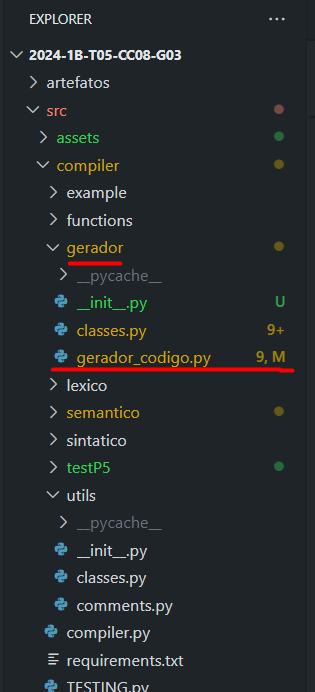
  <p><em>Arquivo Gerador_compiler</em></p>
</div>

Dentro do arquivo, no final dele, iremos encontrar um bloco ```if "__name__" == "__main__" ```. Nele, temos uma váriavel chamada Arvore, que devemos substituir o seu valor pela árvore gerada pelos últimos passos.

<div style="text-align: center;">
  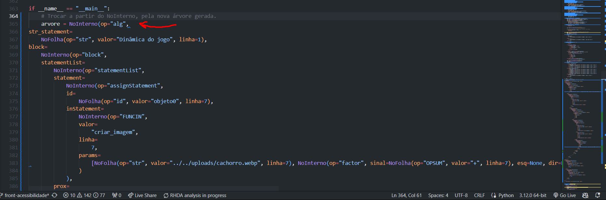
  <p><em>Trocando árvore</em></p>
</div>

Com a nova árvore, devemos acessar esse diretório pelo terminal e rodar o seguinte comando.

```
python .\gerador_compiler.py
```
O output será o código AXE transpilado para o Javascript.


**Testando o javascript**:

Para testar o Javascript, é necessário copiar o código gerado e acessar o arquivo "script.js" que se encontra na pasta "testP5".

<div style="text-align: center;">
  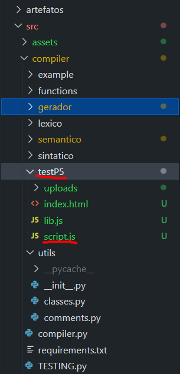
  <p><em>Adicionando Javascript no script.js</em></p>
</div>

No arquivo "script.js", adicionamos o código javascript que foi transpilado do código AXE.

Para conseguir visualizar o teste, podemos baixar um extensão do VSCode, chamada Live Server, ou iniciar um servidor python.

**Baixando extensão Live Server**:

Primeiro, acessamos a área de extensão do VSCode:

<div style="text-align: center;">
  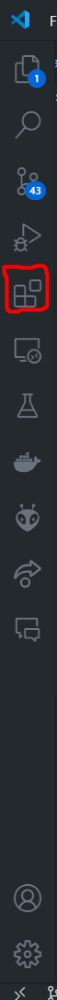
  <p><em>Aba de Extensão do VSCode</em></p>
</div>

Baixamos a extensão Live Server.

<div style="text-align: center;">
  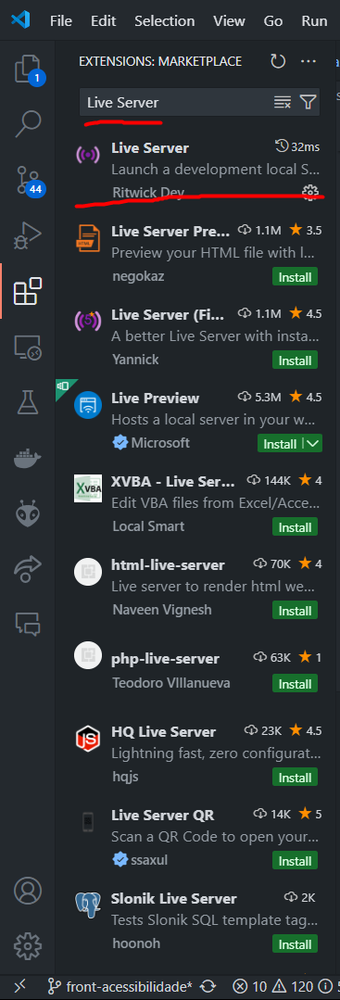
  <p><em>Baixando Extensão</em></p>
</div>

Com a extensão Live Server baixada, clicamos com o botão esquerdo em cima do arquivo index.html e selecionamos a opção **Open with Live Server**.

<div style="text-align: center;">
  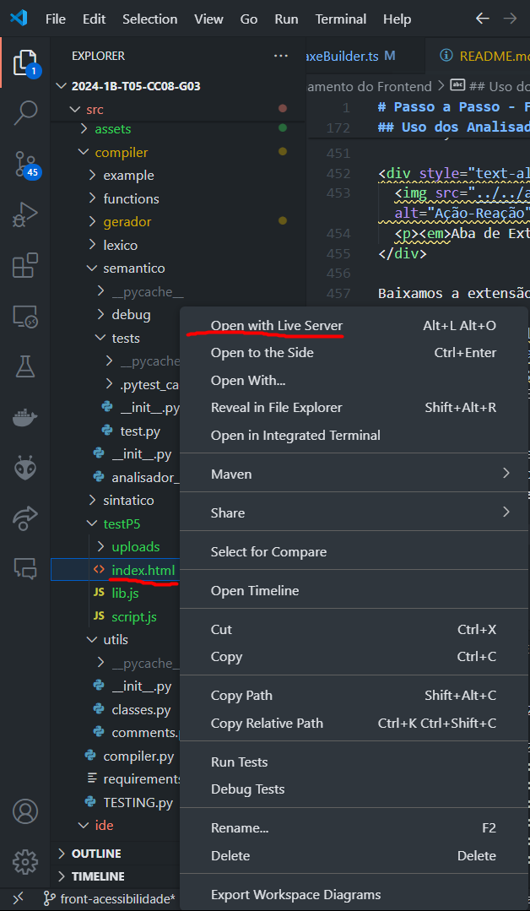
  <p><em>Iniciando o Live Server</em></p>
</div>

Ao clicar, irá abrir uma nova aba com a aplicação de Teste.

<div style="text-align: center;">
  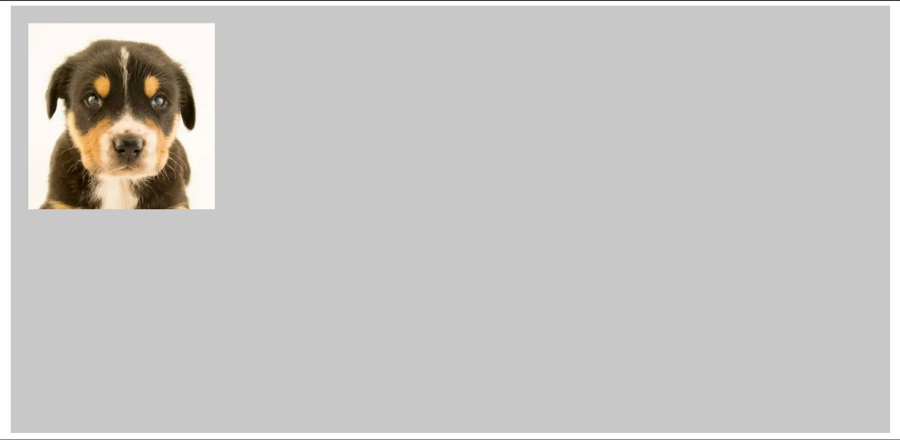
  <p><em>Teste do Cachorro</em></p>
</div>

**Iniciando Teste com Servidor Python**

Se não conseguir utilizar o Live Server, podemos utilizar python para iniciar um servidor e conseguir acessar nossa aplicação de teste.

Primeiro, devemos usar o seguinte comando:

```
npm install -g http-server
```

Acessamos no terminal, o diretório em que se encontra o arquivo html/js que queremos rodar em nosso servidor e usamos o seguinte comando:

<div style="text-align: center;">
  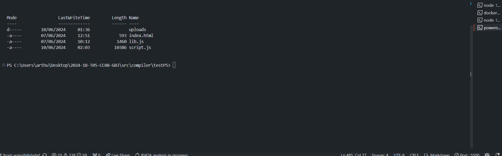
  <p><em>Diretório do Teste</em></p>
</div>

```
python -m http.server 8000
```

<div style="text-align: center;">
  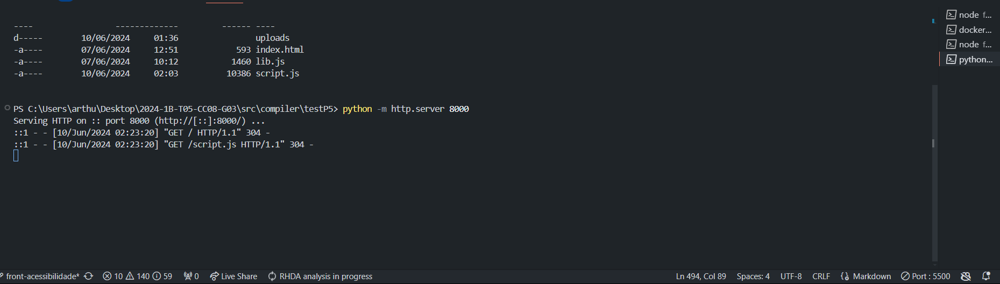
  <p><em>Servidor Python Rodando na Porta 8000</em></p>
</div>

Com isso, acessamos o link: http://localhost:8000/ e conseguimos visualizar a aplicação.

<div style="text-align: center;">
  
  <p><em>Aplicação do Cachorro do Cachorro</em></p>
</div>

**Obs**: Este manual está em desenvolvimento. Na versão final, essa parte manual para gerar o código não será necessária, pois todo o processo será realizado automaticamente dentro do Ambiente de Desenvolvimento criado pelo grupo.