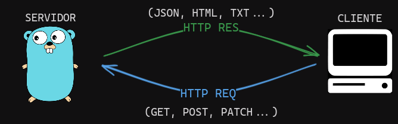
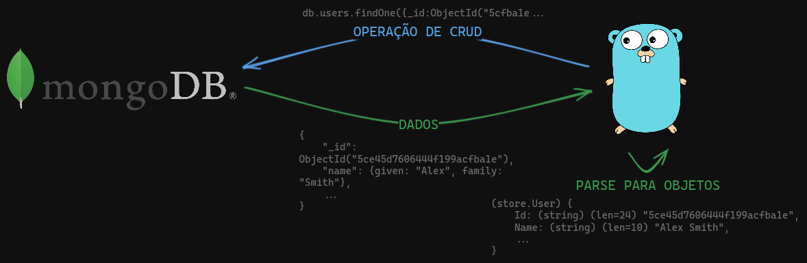
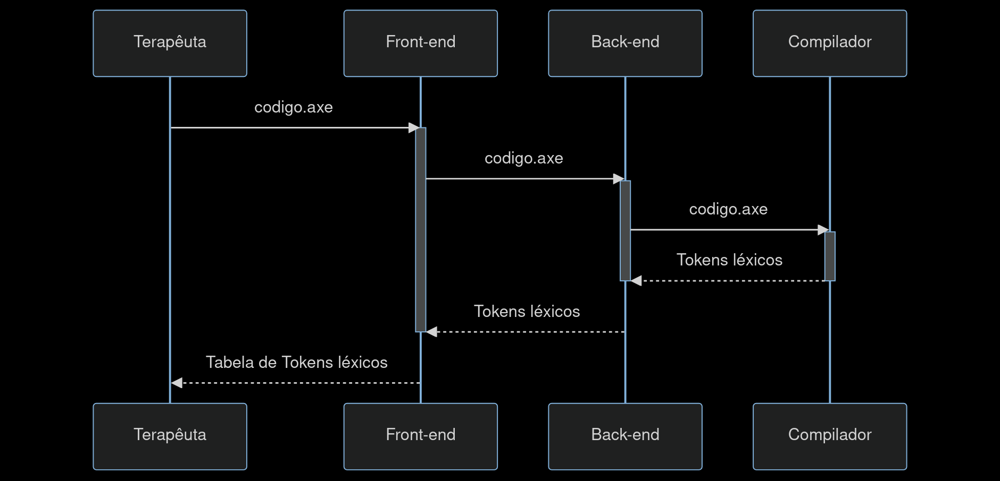
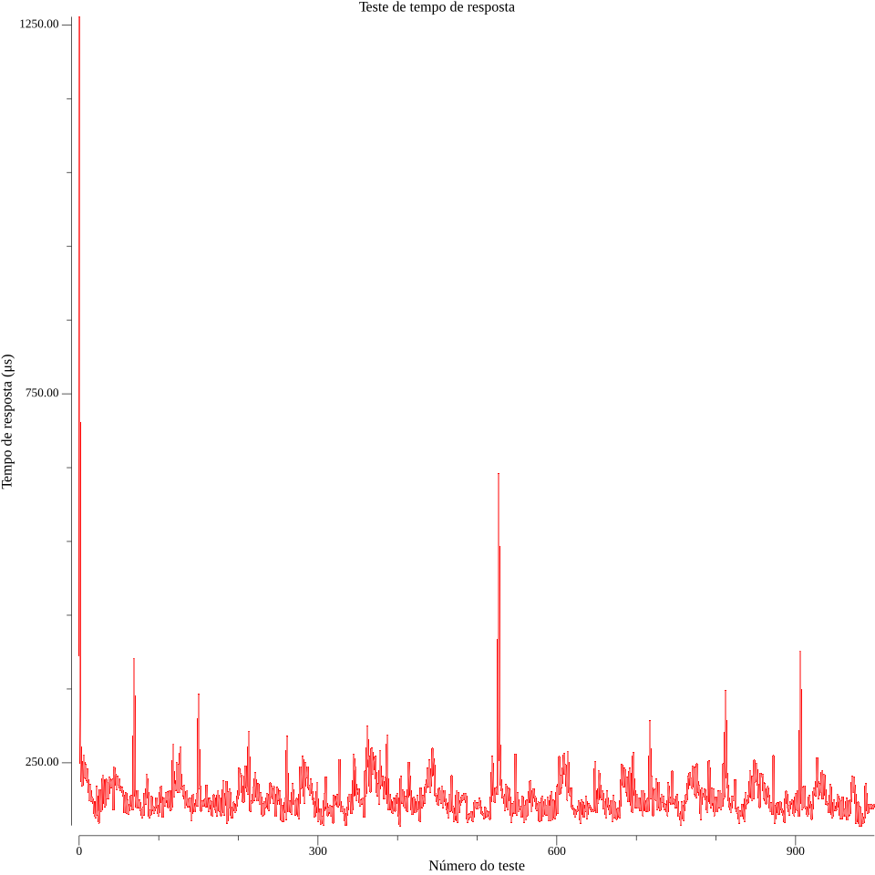
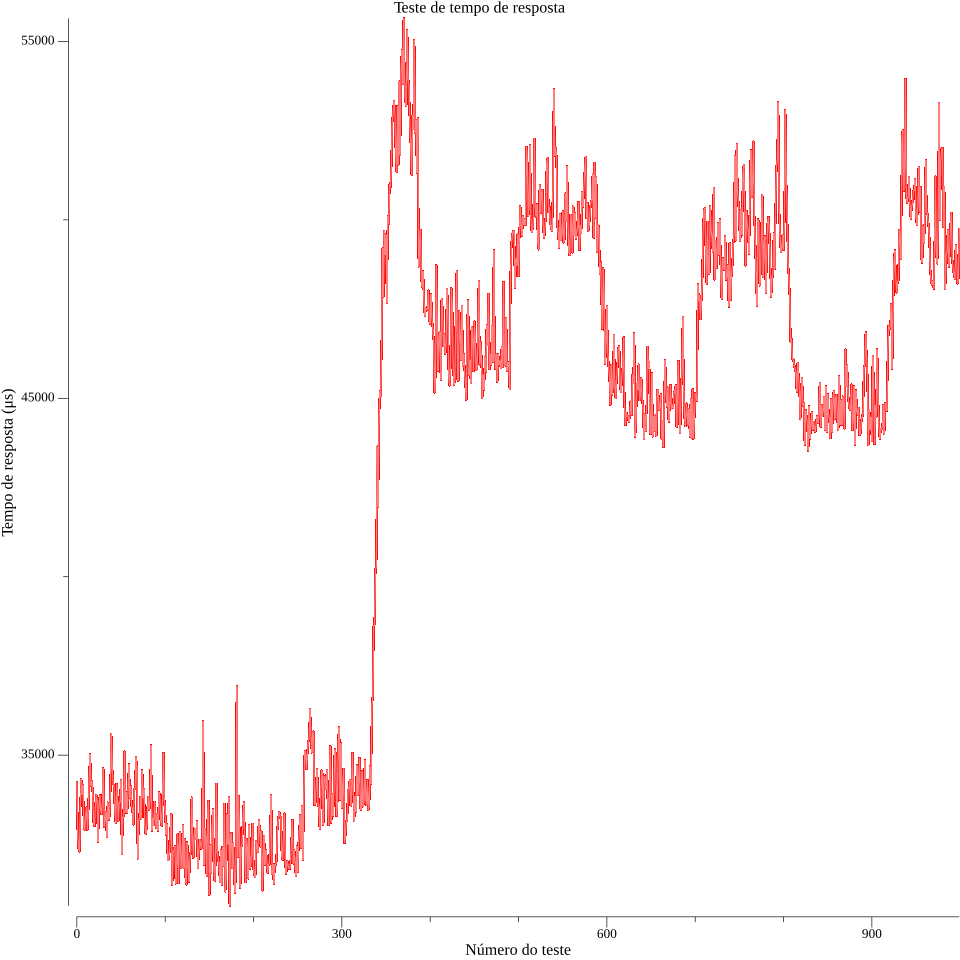

# Back-end Axé

O back-end é um servidor responsável por fazer toda a parte da lógica de negócio da solução. Ele irá fazer todo o processamento dos dados, manuseio da base de dados e a integração com o serviço do compilador.

## Funcionamento

O back-end desenvolvido é um servidor HTTP (Hypertext Transfer Protocol), que se comunica com outras máquinas a partir do framework TCP/IP.

Ele funciona da seguinte maneira:

<div align="center">
    
</div>

As interações com o back-end com a máquina do cliente serão interfaceadas pelo front-end, onde a máquina mandará requisições HTTP para o servidor. O servidor, por sua vez, retornará dados nos formatos mais adequados, permitindo que o front-end formate esses dados para dispô-los na tela do cliente.

## Tecnologias utilizadas

Para a produção do servidor, foi-se usada a linguagem de programação GO. O Golang foi desenvolvido pela Google e tem o objetivo de aumentar a eficiência de processos, através da simplificação na sintaxe (sem perder o controle de uma linguagem mais baixo nível), otimização do paralelismo e a construção de uma biblioteca de ferramentas bastante robusta.

O framework utilizado para rodar o servidor web foi o Echo. Ele permitiu que o grupo fizesse todo o roteamento, a produção de logs de forma organizada e a garantia da escalabilidade do servidor.

Para o armazenamento dos dados, o banco de dados não relacional MongoDB está sendo utilizado. Ele é um banco de dados de documentos de grande popularidade no mercado atual devido os seus recursos de flexibilidade e de escalabilidade.

A conexão do banco de dados com o back-end é feita através do driver oficial do Mongo para Go.

<div align="center">

</div>

## Endpoints

A seguir, foi ilustrada a tabela dos endpoints do servidor para tornar as suas funcionalidades mais explícitas:

| Endereço | Método | Funcionalidade |
| - | - | - |
| / | GET | Retorna uma string, serve para testar se o servidor está funional |

### Grupo léxico

O grupo léxico é responsável por fazer todo o processamento léxico da linguagem de programação .axe. Os dados enviados ainda não são guardados em nenhum banco de dados.

| Endereço | Método | Funcionalidade |
| - | - | - |
| /api/lexico | POST | Solicita um corpo plain/text na requisição com código .axe de forma clara. Retorna a classificação dos tokens léxicos em JSON |

Abaixo, foi ilustrado por meio de um diagrama UML, o processo de processamento léxico do código fonte:

<div align="center">

</div>

### Grupo sintático

O grupo sintático é responsável por fazer todo o processamento sintático da linguagem de programação .axe. Os dados enviados ainda não são guardados em nenhum banco de dados.

| Endereço | Método | Funcionalidade |
| - | - | - |
| /api/sintatico | POST | Solicita um corpo plain/text na requisição com código .axe de forma clara. Retorna uma string contendo todos os nós da AST |

### Grupo semântico

O grupo semântico é responsável por fazer todo o processamento semântico da linguagem de programação .axe. Os dados enviados ainda não são guardados em nenhum banco de dados.

| Endereço | Método | Funcionalidade |
| - | - | - |
| /api/semantico | POST | Solicita um corpo plain/text na requisição com código .axe de forma clara. Retorna StatusOk caso o código não possua nenhum erro semântico. Caso contrario retorna StatusBadRequest |


### Grupo DB (WORK IN PROGRESS)

O grupo DB é responsável por fazer todas as operações do banco de dados.

| Endereço | Método | Funcionalidade |
| - | - | - |
| /api/db | GET | Faz um ping no banco de dados para verificar se a conexão com o mesmo está estável |

## Testes

Os testes da aplicação são essenciais para garantir o seu funcionamento correto e para ter ciência de que ela irá conseguir suprir a demanda de maneira satisfatória.

### Parâmetros de controle

No presente momento, os testes de back-end foram realizados localmente, com o mesmo rodando em um container docker. Além disso, o código axé utilizado em ambos os testes no endpoint "/api/lexico" foi disponibilizado abaixo:

```
programa
"Descrição do programa (como uma string)
Nesta seção, você poderá escrever um texto de múltiplas linhas,
descrevendo o funcionamento básico do programa e dando instruções ao
usuário da aplicação. Esse texto deverá aparecer em algum lugar na
interface desenvolvida por vocês."

/# Este é um
comentário de
múltiplas linhas #/
# Comentário de uma única linha
# Abaixo fica a seção de declaração de variáveis
var
numero x, y, z; # ou seja, x, y e z são do tipo numero (inteiro)
texto a, b;
{
    x: 0;
    y: 5;
    a: "ola";
    b: "mundo";
    se (a = b e b != a){
        mostrar("Ola");
    }
    senao{ # o bloco senao é opcional
        mostrar("nao sei");
    }
    enquanto (x < y){
        x: x + 1;
        mostrar(x);
    }
    repita(10) {
        /# o que estiver aqui dentro será repetido 10 vezes.
        Note que não há variável de controle dentro deste bloco
        #/
    }
}
```

### T01 - Tempo de resposta

O tempo de resposta diz respeito ao intervalo de tempo que um servidor demora para enviar as informações para o computador do cliente. Quanto menor o tempo de resposta, melhor o desempenho do servidor.

<div align="center">
    
</div>
<div align="center">
teste de tempo e resposta do endpoint "/"
</div>

| Endpoint | N° de Testes | N° de Sucessos | Tempo de resposta média |
| - | - | - | - |
| / | 1000 | 1000 | 204 μs |

<div align="center">
    
</div>
<div align="center">
teste de tempod de resposta do endpoint "/api/lexico"
</div>

| Endpoint | N° de Testes | N° de Sucessos | Tempo de resposta média |
| - | - | - | - |
| /api/lexico | 1000 | 1000 | 42.85 ms |

O primeiro gráfico demonstra um comportamento mais uniforme dos tempos de respostas, tendo oscilações normais devido a escala de tempo trabalhada.

O segundo gráfico possui uma oscilação mais significativa por volta da 350ª requisição. Como muitos testes foram rodados em paralelo, uma possível hipótese para isso se dá ao uso do paralelismo para fazer os múltiplos testes ao mesmo tempo, fazendo com que alguns testes tenham deixado outros em espera devido o servidor estar ocupado.

### T02 - Teste de carga

O teste de carga tenta simular o uso da aplicação no mundo real, fazendo com que a maquina tenha que lidar com múltiplos acessos simultâneos para observar o seu comportamento durante momentos de pico.

```
          /\      |‾‾| /‾‾/   /‾‾/
     /\  /  \     |  |/  /   /  /
    /  \/    \    |     (   /   ‾‾\
   /          \   |  |\  \ |  (‾)  |
  / __________ \  |__| \__\ \_____/ .io

     execution: local
        script: get.js
        output: -

     scenarios: (100.00%) 1 scenario, 10 max VUs, 1m30s max duration (incl. graceful stop):
              * default: 10 looping VUs for 1m0s (gracefulStop: 30s)


     data_received..................: 95 kB 1.6 kB/s
     data_sent......................: 48 kB 799 B/s
     http_req_blocked...............: avg=11.31µs  min=781ns    med=4.34µs   max=559.1µs  p(90)=8.85µs   p(95)=10.65µs
     http_req_connecting............: avg=3.3µs    min=0s       med=0s       max=358.77µs p(90)=0s       p(95)=0s
     http_req_duration..............: avg=731.92µs min=107.22µs med=681.12µs max=30.01ms  p(90)=1.07ms   p(95)=1.19ms
       { expected_response:true }...: avg=731.92µs min=107.22µs med=681.12µs max=30.01ms  p(90)=1.07ms   p(95)=1.19ms
     http_req_failed................: 0.00% ✓ 0       ✗ 600
     http_req_receiving.............: avg=47.46µs  min=8.38µs   med=38.99µs  max=246.19µs p(90)=88.26µs  p(95)=99.91µs
     http_req_sending...............: avg=21.6µs   min=3.48µs   med=17.15µs  max=171.28µs p(90)=35.36µs  p(95)=40.41µs
     http_req_tls_handshaking.......: avg=0s       min=0s       med=0s       max=0s       p(90)=0s       p(95)=0s
     http_req_waiting...............: avg=662.85µs min=87.21µs  med=597.91µs max=29.89ms  p(90)=994.52µs p(95)=1.11ms
     http_reqs......................: 600   9.98244/s
     iteration_duration.............: avg=1s       min=1s       med=1s       max=1.03s    p(90)=1s       p(95)=1s
     iterations.....................: 600   9.98244/s
     vus............................: 10    min=10    max=10
     vus_max........................: 10    min=10    max=10
```

<div align="center">
teste de carga do endpoint "/"
</div>

| Endpoint | N° de máquinas virtuais | Tempo de teste | Número de requisições | Requisições por segundo |
| - | - | - | - | - |
| / | 10 | 1 min | 600 | 9.98 |

<br></br>

```
          /\      |‾‾| /‾‾/   /‾‾/
     /\  /  \     |  |/  /   /  /
    /  \/    \    |     (   /   ‾‾\
   /          \   |  |\  \ |  (‾)  |
  / __________ \  |__| \__\ \_____/ .io

     execution: local
        script: post.js
        output: -

     scenarios: (100.00%) 1 scenario, 10 max VUs, 1m0s max duration (incl. graceful stop):
              * default: 10 looping VUs for 30s (gracefulStop: 30s)


     data_received..................: 1.2 MB 40 kB/s
     data_sent......................: 280 kB 9.1 kB/s
     http_req_blocked...............: avg=12.65µs  min=1.54µs  med=4.45µs  max=259.84µs p(90)=12.22µs  p(95)=17.97µs
     http_req_connecting............: avg=3.17µs   min=0s      med=0s      max=227.6µs  p(90)=0s       p(95)=0s
     http_req_duration..............: avg=55.35ms  min=32.7ms  med=44.99ms max=147.81ms p(90)=89.03ms  p(95)=111.53ms
       { expected_response:true }...: avg=55.35ms  min=32.7ms  med=44.99ms max=147.81ms p(90)=89.03ms  p(95)=111.53ms
     http_req_failed................: 0.00%  ✓ 0       ✗ 290
     http_req_receiving.............: avg=144.49µs min=22.75µs med=72.74µs max=3.09ms   p(90)=238.51µs p(95)=399.15µs
     http_req_sending...............: avg=30.83µs  min=7.8µs   med=24.05µs max=117.38µs p(90)=54.59µs  p(95)=77.31µs
     http_req_tls_handshaking.......: avg=0s       min=0s      med=0s      max=0s       p(90)=0s       p(95)=0s
     http_req_waiting...............: avg=55.18ms  min=32.62ms med=44.9ms  max=147.74ms p(90)=88.4ms   p(95)=111.1ms
     http_reqs......................: 290    9.44652/s
     iteration_duration.............: avg=1.05s    min=1.03s   med=1.04s   max=1.14s    p(90)=1.08s    p(95)=1.11s
     iterations.....................: 290    9.44652/s
     vus............................: 10     min=10    max=10
     vus_max........................: 10     min=10    max=10
```

<div align="center">
teste de carga do endpoint "/api/lexico"
</div>

| Endpoint | N° de máquinas virtuais | Tempo de teste | Número de requisições | Requisições por segundo |
| - | - | - | - | - |
| /api/lexico | 10 | 1 min | 290 | 9.45 |


### Conclusões

Ambos os testes foram altamente satisfatórios e dentro da expectativa da equipe. Posteriormente, serão incluídos também os testes da aplicação rodando em nuvem, para que seja possível observar de forma mais realista o contexto o qual o produto desenvolvido realmente será utilizado.

## Instalação

Para instalar o back-end, será necessário ter o [Docker](https://docs.docker.com/get-started/) instalado na máquina. Com o mesmo funcionando, é possível fazer o servidor rodar usando o docker compose.

```yaml
--- #docker-compose.yaml
services:
    app:
        container_name: axe-backend
        image: guilhermenl/axe-backend:latest
        ports:
        - "<PORTA_HOST>:<PORTA_CONTAINER>"
        environment:
        - PORT=<PORTA_CONTAINER>
        - DATABASE=<NOME_DO_BANCO_DE_DADOS_MONGO>
        - DATABASE_URI=mongodb://<USUARIO_BD>:<SENHA_DB>@<ENDERECO_BD>:<PORTA_BD>/?timeoutMS=5000
```

```sh
docker compose up
```
