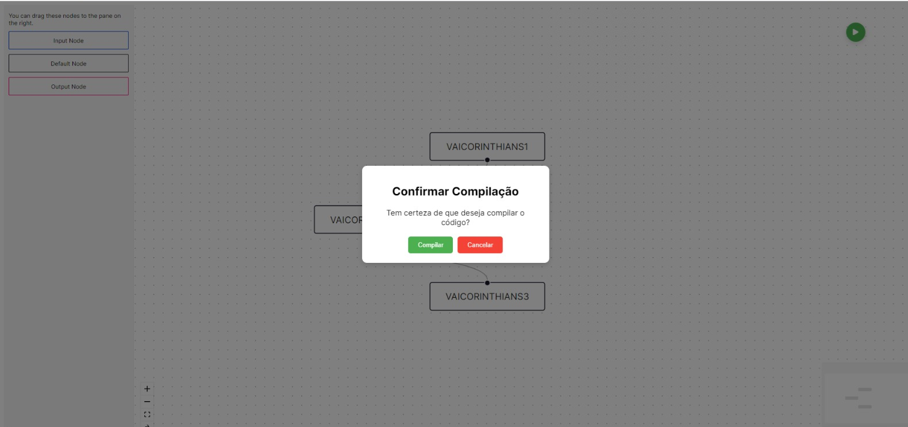

## Front-end Axé

O frontend é a interface com a qual o usuário interage para fornecer entrada e visualizar saída do sistema Axé. Ele é responsável por renderizar os elementos visuais e facilitar a interação com o usuário, além de coordenar a comunicação com o backend para processamento de dados.

## Funcionamento

O frontend foi desenvolvido utilizando React, uma biblioteca JavaScript popular para a criação de interfaces de usuário. Ele funciona da seguinte maneira:

- Os terapeutas ocupacionais interagem com a interface do frontend, que oferece um editor visual de fluxo de dados e elementos de controle intuitivos.

- Eles podem arrastar e soltar diferentes nós para criar um fluxo de dados personalizado para cada criança.

- Ao clicar em um nó, uma modal é aberta, permitindo a edição do conteúdo do nó para adaptar às necessidades individuais do paciente.

- Quando estão prontos, os terapeutas podem iniciar o processamento do código ao clicar em um botão específico na interface.

- O frontend então envia o código compilado para o backend através de requisições HTTP, onde é processado e retorna os resultados para exibição na interface.

    

## Tecnologias utilizadas

Para o desenvolvimento do frontend, foram utilizadas as seguintes tecnologias:

- React: Uma biblioteca JavaScript para construção de interfaces de usuário interativas.
- ReactFlow: Uma biblioteca React para criação de diagramas de fluxo de dados interativos.
- React Icons: Uma biblioteca de ícones para uso em aplicações React.

## Escopo do Projeto 

Este é apenas o primeiro passo no desenvolvimento do frontend do projeto Axé. Muitas melhorias estão planejadas para tornar a interface mais intuitiva e fácil de usar para os terapeutas ocupacionais. O objetivo final é proporcionar uma experiência de uso fluida e eficiente, permitindo que os terapeutas se concentrem no tratamento das crianças com TEA de forma personalizada e eficaz.

## Próximos Passos

Os próximos passos incluem:

- Refinamento da interface do usuário para torná-la mais intuitiva e amigável.
- Implementação de recursos adicionais para suportar uma variedade de atividades terapêuticas.
- Melhorias na comunicação entre o frontend e o backend para otimizar o processamento de dados.
- Testes extensivos para garantir a estabilidade e confiabilidade da plataforma.
